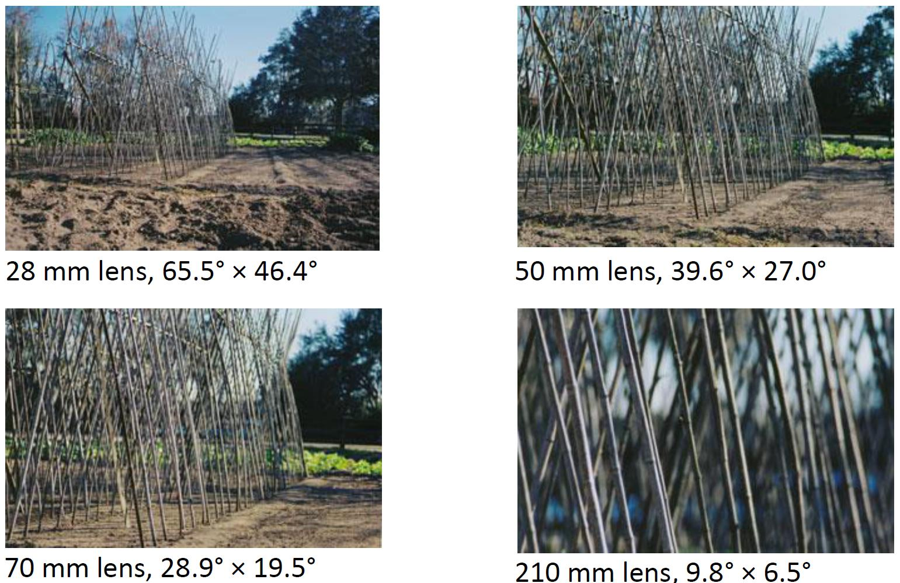

# 1 - Introduction and imaging basics

#### Computer vision tasks

* Recognize images
* Localise and identify objects
* Segment image regions
* Model relations between images
* Recover 3D structure
* Perform visual navigation
* Perform visually guided actions (e.g., grasping objects)

#### Pinhole camera model

* xi = x * f / z
* yi = y * f / z

Pinhole camera: simple design, not common in practice

* Because of not enough light

Instead of a pinhole, most cameras use lenses

#### Lenses

* Lenses focus light rays onto a single point (F) at a distance ( f ) beyond the lens.
* Aperture diameter (D) restricts the range of rays.

#### Focal length / angle of view

#### Depth of field

* In cameras, aperture size controls depth of field (smaller aperture = greater range of depth in focus)

#### Image formation model

* **World parameters**
  * Light source
  * Surface properties
* **Camera parameters**
  * Focal length / angle of view
  * Aperture size / depth of field
  * Lens distortion

#### Digital images

**A tensor (3D dimensional array of values)**

* Width x height x channel
* 3 channels = RGB colour image (red, green, blue)
* 1 channel = grayscale image

**Note: the exact format can vary across libraries / languages!**

* E.g., “channel first” = channel x height x width
* Height x width x channel
* BRG = blue, red, green

**Pixel = smallest unit of an image**

* Grayscale image: pixel is a grayscale value
* Colour image: pixel is a 1x3 vector
* (0, 0) from left top

**Most common data type is uint8 (unsigned 8-bit integers)**

* Range 0 - 255
* “24 bit colour” = 3 uint8 channels

**But you may encounter other data types:**

* double (range 0.0 - 1.0)
* uint16, uint32: medical images
* float32: high dynamic range (HDR) images

**File formats**

* Lossy compression: Some image formats discard information to save space
  * JPEG (.jpg, .jpeg)
* Lossless compression
  * PNG (.png), BMP (.bmp), GIF (.gif), TIF (.tif, .tiff).

#### Image manipulation

**Image scaling**	**L1.2 P36**

* Crop = extract a subset of the image array (doesn’t require resampling)
* Resize = change the dimensions of the image array (requires resampling)

**Resampling methods**

* Nearest-neighbour: closest value to sample point
  * Simple, preserves hard edges
  * Smooth curves may be blocky/distorted

* Bilinear: weighted average of 4 pixels around sample point

  * Smoother curves, but blurs hard edges

  * Slower to compute

* Other options: bicubic, Lanczos
* Different resampling methods give different results

#### Summary

* An image is a pattern of light from the world, projected onto a 2D surface
* A digital image is a sample of this pattern, represented as a tensor
* Images of the same scene can vary widely at the pixel level, due to:
  * Camera parameters (focus, field of view)
  * Digital processing steps (compression, resampling)

