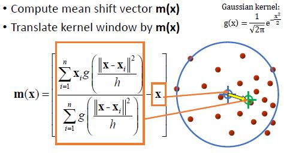
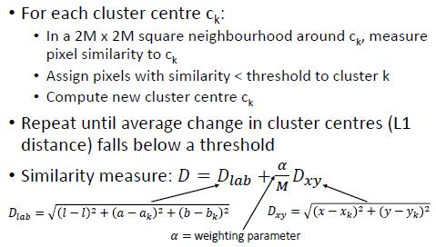
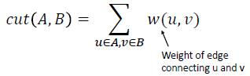
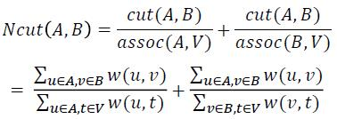
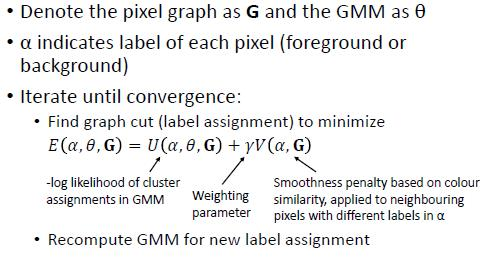
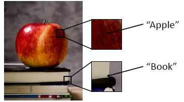
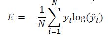
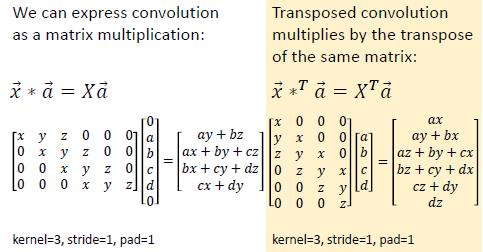
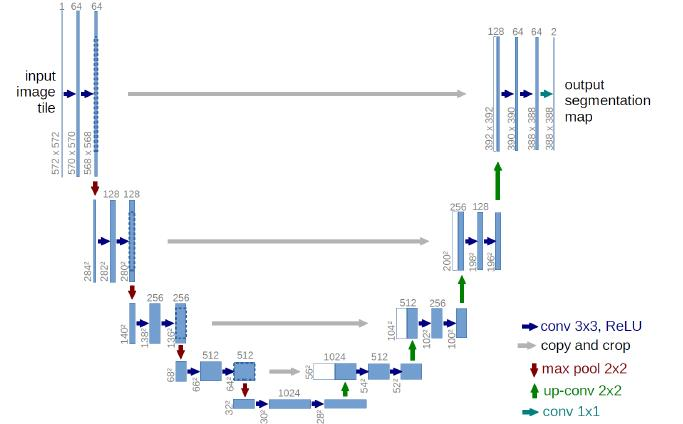

# 10 - Image segmentation

#### Definitions	L10.1 P3-6

* Segmentation: Separate image into different regions (objects, textures)
* Semantic segmentation: Separate image into different labelled regions
* Instance segmentation

### Pixel Clustering

#### Colour clustering	L10.1 P10-12

* K-means
* Gaussian mixture model

#### Mean shift clustering	L10.1 P13

* Assume points are samples from an underlying probability density function (PDF)
* Compute peaks of PDF from density of points

* For each point:
  * Centre a window on that point
  * Compute the mean of the data in the search window
  * Centre the search window at the new mean location
  * Repeat ( b,c ) until convergence
* Assign points that lead to nearby modes to the same cluster
* Free parameters: kernel (commonly Gaussian), bandwidth
* Cluster in spatial+colour space; e.g.: ( x,y,R,G,B ) or (x,y,L,A,B ) coordinates
* Increase spatial bandwidth -> Increase the region so that more pixels are included    L10.1 P26

#### Summary - Pixel clustering

* Pixel clustering is a fast, simple approach to image segmentation
* Example: mean shift clustering in the colour+spatial domain
  * Automatically discover number of clusters; no need to choose k
  * But do need to choose bandwidth
* Pixel clustering separates colour regions - regions may not correspond to objects

### Superpixels	L10.1 P30

* Oversegmentation methods segment image into regions that are smaller than objects
  * Objects are separated from background
  * But objects are also separated into many parts
* Superpixels = groups of adjacent pixels with similar characteristics (e.g., colour)

#### SLIC superpixel algorithm

* Initialise cluster centres on non-edge pixels:
  * Initialise k cluster centres ck = [xk, yk, lk, ak, bk] by sampling the image in a regular grid
  * For each centre ck, check an N x N neighbourhood around ck to find the pixel with lowest gradient. Set ck to this pixel’s [x, y, l, a, b].

#### 

* Similarity metric does not guarantee that clusters will be connected pixels
* To enforce connectivity, pixels not connected to main cluster are re-assigned to closest adjacent cluster

##### Superpixel methods	L10.1 P34

#### Applications:

* Superpixels are a multipurpose intermediate image representation
* More compact representation for algorithms with high time complexity (600x800 pixels --> 200 superpixels
* Common application: object segmentation
  * Oversegment image
  * Combine superpixels to find objects

#### Subpixel merging

* Region Adjacency Graph (RAG)
  * Vertices = image regions (pixels or superpixels)
  * Edge weights = difference between regions
* To merge superpixels:    L10.1 P37
  * Identify edges below a threshold and re-label superpixels connected by these edges as one region
  * Or iteratively:
    * Find lowest weight edge, relabel connected superpixels as one region
    * Recompute RAG, repeat until a criterion is met (e.g., all edges above a threshold)

#### Summary - Superpixels

* Superpixels = regions of similar pixels, produced through oversegmentation
* Various algorithms for computing superpixels , SLIC is one common option
* Superpixels are a compact, intermediate representation used as a first step for:
  * Segmentation (especially graph based methods)
  * Object detection/localisation
  * Video tracking

### Graph-based segmentation	L10.1 P40

#### Images as graphs

* Represent image as a graph G = (V, E)
  * Vertices = image regions (pixels or superpixels
  * Edge weights = difference between regions

#### Graph cuts

* Consider image as a fully connected graph
* Partition graph into disjoint sets A,B to maximize total edge weight = remove low-weight edges between dissimilar regions
* Minimize value of cut:

* Not ideal for image segmentation - tends to create small, isolated sets
* Normalised cut    L10.1 P44
  * Instead of minimizing cut value, minimize cut value as a fraction of total edge connections in entire graph (normalised cut)

* GrabCut
  * Segments image pixels into just two classes: foreground (object) and background
  * Uses colour clustering + graph cuts to find optimal classification of pixels into each class
  * Requires user to initialise algorithm with a bounding box    L10.1 P46
    * Outside box = background pixels
    * Inside box = treat as foreground pixels initially
  * For each class (foreground, background), represent distribution of pixel colour as a Gaussian mixture model (GMM)
  * Represent image pixels as a graph (8 way connectivity)

#####         

* GrabCut example and result    L10.1 P49, 50

#### Summary - Graph-based segmentation

* Graph based methods represent an image as a graph (of pixels or superpixels)
* Segmentation removes edges to break graph into subgraphs, generally trying to optimize:
  * Similarity within connected region
  * Dissimilarity across disconnected regions
  * Smoothness/connectivity of connected regions
* Normalized cuts - segment into multiple regions
* GrabCut - segment into foreground/background

### Summary I

* Various ways to approach image segmentation, but many methods use some combination of pixel clustering and graph analysis
* The methods discussed so far do segmentation but not semantic segmentation (regions with no labels)
* How to get labels?
  * Unlabelled regions can be input to an object classification method
  * Or, segmentation and classification can be done simultaneously

### Segmentation as classfication

#### Pixel classification

* Image segmentation as a classification problem
* Given a window ( NxN pixels), classify central pixel

##### 

* Classifying individual pixels is potentially very slow (e.g., a small image = 600x800 = 480,000 pixels)
* But a CNN can classify multiple pixels in parallel
  * Parallel patch classification    L10.2 P12

#### Fully-convolutional network

* Fully connected network (FCN) has only convolutional layers, no fully connected layers
* Last layer is a spatial map
* Can accept any size image as input, output map size depends on input size

#### Parallel patch classification	L10.2 P14

* Standard CNN architecture poses two problems:
  * Receptive field size is linear with the number of convolutional layers
  * Most methods downsample (e.g., with maxpooling) to reduce computation
    * We could avoid maxpooling , but this will make the network slow and doesn’t solve the first problem
* Solution: use encoder decoder structure
* Encoder downsamples image, decoder upsamples
* 1x1 convolution layer
  * Convolutional layer with a 1x1 kernel
  * Commonly found as last layer(s) of a fully-connected network
  * It maps an input pixel with all its channels to an output pixel which can be squeezed to a desired output depth.
* Loss function
  * At each pixel, compute cross entropy loss between predicted class and known classes

#### Max Unpooling    L10.2 P17

* Revert the effect of the max pooling operation - work as an upsampler
* Each upsampling layer is paired with a downsampling layer
* The locations of the max items are saved and passed to upsampler

#### Transposed convolution	L10.2 P20

* Convolution with stride > 1 does a form of downsampling
  * E.g., stride = 2 means filter moves 2 pixels in input for every 1 pixel in output
  * “Learnable downsampling
* Can we reverse this to do upsampling?
  * E.g., filter moves 2 pixels in output for every 1 pixel in input
* Transposed convolution : convolution with a stride < 1
  * In some papers, may also be called deconvolution, upconvolution , fractionally strided convolution

* 1D Example    L10.2 P24

##### Segmentation with FCN results	L10.2 P30. 31

#### Summary

* Semantic segmentation can be treated as a pixel classification problem
* This can be done efficiently with a fully-convolutional network
* Encoder decoder architecture:
  * Downsample with max pooling, strided convolution
  * Upsample with max unpooling , transposed convolution
* Output is a label for each pixel

### U-Net	L10.2 P34

* U Net: fully convolutional network for segmentation, with some modifications
* Originally proposed for medical image segmentation, 
* Originally for medical image analysis, but commonly used for other segmentation tasks
* Encoder-decoder structure with some additional features

* In decoder, the upsampled feature map is concatenated with the original features from the corresponding encoder layer
* For cell segmentation, U-Net uses only 2 classes and weighted cross-entropy loss: edges between cells have higher weight
* Also used as an encoding decoding network for tasks like:
  * Image denoising
  * Image inpainting

### Instance segmentation

* Semantic segmentation classifies pixels, doesn’t distinguish between instances
* Visual scenes include both “things” and “stuff”
  * “Things” = objects, “countable nouns” (cow, person, car)
  * “Stuff” = regions/materials, “mass nouns” (road, grass)
  * Some classes can be either (trees)
* Instance segmentation (and computer vision in general) mainly focusses on “things”
* Instead of giving each pixel an instance label, extract patches of image that are likely to be separate instances
* Do segmentation within each patch
* Commonly used architecture: Mask-R-CNN

#### R-CNN

* R CNN = Region based convolutional neural network
* Efficiently extracts “regions of interest” (image patches likely to contain objects) for further processing

#### Mask-R-CNN

* Mask-R-CNN takes patches extracted by R-CNN and runs them through a fully-convolutional network
* FCN predicts a binary segmentation mask (“object” or “background”)
* Results    L10.2 P45,46

#### Summary - Instance segmentation

* Instance segmentation gives separate labels to each instance of a class, not just class labels
* Generally only applies to countable “thing” classes
* Typical methods detect object patches, then do binary segmentation within the patch

### Summary

* Segmentation can be approached in various ways - clustering/graph based methods vs. pixel classification with FCNs
* Advantages of FCNs
  * Better able to handle very complex objects/backgrounds
  * Likely to give better results for the classes on which they are trained
* Disadvantages of FCNs
  * Tend to be worse at capturing precise boundary details
  * May not generalise to classes outside their training set

