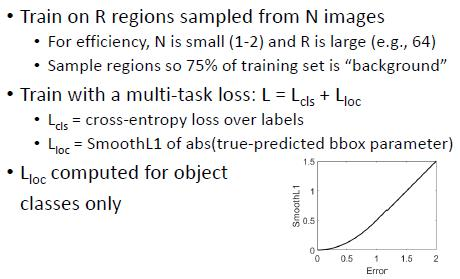

# 11 - Object detection

### Object detection basics

#### Classification vs. Detection

* Object detection = locate objects in an image
  * Classification: “Is this a (class label)?”
  * Detection: “Where is the (class label)?”
* Object detection is usually modelled as a classification task performed within patches of an image
  * Detection: For every patch, “Is this a (class label)?”

#### Sliding window approach	L11.1 P8

* Free parameters
  * Stride
  * Scale (size of window)
  * Shape (aspect ratio)
* Generally object dimensions are unknown, so a range of scales/shapes will be required

* Another parameter: Threshold for detection
  * Windows over the threshold will be considered “target”
  * Note that this makes evaluation tricky    L11.2 P12

* Window evaluation: IoU    L11.2 P13
  * Common method to evaluate a window result is **Intersection over Union** (IoU) between true bounding box and detection window

#### Summary

* Object detection is generally modelled as image classification within small regions of an image
* Windows over some threshold = “detections,” can be evaluated using IoU with ground truth
* Problems:
  * Very large number of possible windows (slow, increases probability of false detections)
  * Overall evaluation of images with multiple targets can be complicated (multiple targets, multiple detection windows, different IoUs)

### R-CNN

####  Sliding window classification

* Very large number of windows per image (C scales x S shapes x N locations)
* Even in a neural network, classifying all possible boxes may be slow (may also increase false alarms)
* Solution: Focus on boxes most likely to be objects

#### R-CNN

* R CNN = Region-based convolutional neural network
* Given an image, identify a small number of windows for object detection (“region proposals” or “regions of interest (ROIs)”)
* Generating region proposals
  * R-CNN uses **Selective Search** to generate ROIs
  * Selective Search algorithm:
    * Oversegment image into superpixels
    * Iteratively combine adjacent superpixels based on similarity in colour + texture, size, and compactness

#### Bounding box computation

##### 

#### R-CNN training

* CNN pretrained on ImageNet
* Last layer (1x1000) is replaced with a new classification layer of size 1x(N+1)
  * N+1 = N object classes + “background” class
  * CNN is retrained on (N+1)-way detection, using regions with IoU >=0.5 as ground truth "objects"
  * Sample regions so 75% of training set is “background”
* CNN features are used as input to:
  * Label classification model (1 vs all linear SVM)
  * Bounding box model (class specific linear regression)

#### R-CNN testing

* Input test image
* Compute region proposals (Selective Search)
* Each region: run through CNN to predict class labels and bounding box transforms
* “Detections” = regions with highest class confidence scores
  * Based on a threshold, or top k?
  * Overall, or per-category?

##### R-CNN results    L11.1 P30, 31

#### Summary - R-CNN

* R-CNN (Region-based convolutional neural network) does classification in parallel over a set of region proposals
* Output: class labels and bounding box transforms
* Advantage: Much more efficient than classifying every window
* Disadvantages
  * Still requires classifying many windows (e.g., 2000)
  * Region proposal step could miss some objects

#### Fast R-CNN	L11.1 P34

* Major change: run the whole image through a fully convolutional neural network
* Take region proposals from last convolutional layer

* Crop / resize features    L11.1 P39

#### Fast R-CNN training

##### 

#### Summary - Fast R-CNN

* End-to-end region based convolutional neural network
* Advantages
  * Faster than R CNN (~9x faster training, ~140x faster test)
  * Slightly more accurate than R-CNN
* Disadvantages
  * ROIs aren’t learned; region proposal step could miss some objects

#### Faster R-CNN    L11.1 P50

* Major change: network learns region proposals, instead of using Selective Search
* Region proposal network (RPN)
  * An “anchor point” is placed at each column in the feature map
  * Each anchor point generates k regions of fixed size and aspect ratio
* For each region:
  * Crop & resize features
  * Predict object class and bounding box transform
* For each image:
  * Run backbone CNN to get feature map
  * Compute region proposals from RPN

#### Faster R-CNN training

* RPN loss is weighted sum of:
  * Classification loss: binary cross entropy loss (any object vs. background)
  * Regression loss: SmoothL1 between true and predicted bbox parameters
* As in Fast R CNN, training samples R regions (anchors) from N images (R = 256, N = 1)
  * Anchors are sampled so up to 50% are objects
* Full network is RPN + Fast R-CNN (sharing a backbone)
  * Various ways to train this, but original method alternates between training RPN and Fast R CNN

#### Summary - Faster R-CNN

* Faster R-CNN is similar to Fast R-CNN but learns the region proposals with a region proposal network (RPN)
* Even faster than fast R-CNN (~10x faster test)
* Modular approach - variations on Faster R-CNN with deep backbone tend to be quite accurate
  * Speed-accuracy trade off: deeper networks are also slower

### Summary I

* Object detection = classification of image regions
* Exhaustive search is slow; most methods use only a subset of regions (“region proposals” or “regions of interest (ROIs)”)
* Many parameters to consider:
  * What counts as a true detection / true rejection (IoU threshold)?
  * How to select region proposals?
  * How to deal with class imbalance? (“background” is most common class)

### Object detection II

#### Single-stage object detectors

##### YOLO (You Only Look Once) v1	L11.2 P13

* Main idea: instead of going through multiple steps (region proposals, region classification), just predict a heatmap for each class directly in a CNN
* Output is a set of N class probability maps + M bounding box parameter maps
* Loss is sum-squared error between true and predicted maps, with some weighting:
  * Bbox location parameters get higher weight in the loss
  * Grid cells that don’t contain objects don’t contribute to classification loss
  * Bbox parameters are penalised based on their confidence, encouraging the M bboxes to specialise for different objects
* Advantages:
  * Fast
  * Accurate, for a real time object detector
* Disadvantage:
  * Limited spatial precision
  * Generally less accurate than slower detectors
* There have been multiple versions of this algorithm that have improved on the original method

##### SSD: Single shot multibox detector	L11.2 P18

* Similar to YOLO: instead of generating region proposals, directly predict a set of class+bbox heatmaps
  * For each anchor point: k bboxes * (N class confidences * 4 bbox parameters)
* Major change: anchor points in multiple convolutional layers, allowing for detection at different scales
* Faster than region proposal methods like Faster R-CNN
* Generally less accurate than region-proposal methods
* Anchor points in early layers helps with spatial prediction and detection of small objects

##### Alternatives to bounding boxed	L11.2 P22

##### Summary - Single-stage object detectors

* Single-stage detectors skip the region proposal step and predict object classes/bounding boxes directly
* Single-stage methods tend to be faster but less accurate than two stage methods like Faster R-CNN
* Some recent methods simplify the prediction by predicting single points instead of bounding boxes

#### Instance segmentation

##### Common method:

* Instance segmentation can be modelled as object detection followed by binary segmentation (foreground/background)
* Run object detector, extract bounding boxes and labels
* Do binary (foreground/background) segmentation within each bounding box

* Common architecture is Mask R-CNN, which is a modification of Faster R CNN

##### Mask R-CNN	L11.2 P28

* Basically just an extra step on Faster R-CNN - each patch runs through a fully convolutional network that predicts a binary segmentation mask
* Patch loss becomes: L = Lcls + Lbox + Lmask

#### Evaluating object detectors

##### Object detection result

* Typically, object detectors will return many overlapping detections
  * Can be different objects, or the same object detected at multiple scales / positions
* Treat as multiple detections? Or select one as the final prediction?
  * Typical approach: Non-max suppression (NMS)
    * Starting with the highest scoring bounding box…
    * Drop bounding boxes with lower score that overlap with this box above some IoU threshold (e.g., 0.7)
    * Repeat with next highest scoring bounding box
  * Often done separately within each object class
  * Example    L11.2 P35
  * NMS can drop some correct detections when objects are highly overlapping
  * But generally this is preferable to counting the same object many times

##### Evaluation

* How to evaluate, given that there may be multiple objects/detections per image?
* Commonly used method:
  * Run detection on entire test set
  * Run NMS to remove overlapping detections
  * For each object category, compute **Average Precision (AP)** = area under precision recall (P-R) curve
  * Example    L11.2 P40
  * Mean Average Precision (mAP)    L11.2 P50
    * “COCO mAP ”: Compute mAP for multiple IoU thresholds (0.5, 0.55. 0.6, … 0.95) and average
* Common metric for evaluating object detectors is mAP (or COCO mAP)
* Both NMS and P-R steps require IoU thresholds; different thresholds can change results
* Object detection is complex - one number is not very informative
  * How accurate is the object classification?
  * How accurate are the bounding boxes?
  * What kinds of errors is the model making (misses, false alarms)?

#### Beyond patches

##### Scene priors

##### Object detection in context

* Scene context provides both global and local priors:
  * Global prior: likelihood of the object appearing at all
  * Local: likelihood of the object in given location
* Including these priors can help reduce false detections

### Summary II

* Object detection is typically modelled as a patch classification problem
* Various ways to approach the classification problem: two-stage region proposal detectors, single-stage detectors
* However, this is not the only way to approach object detection - information outside the patch (scene context) can also be used to predict object presence / location

