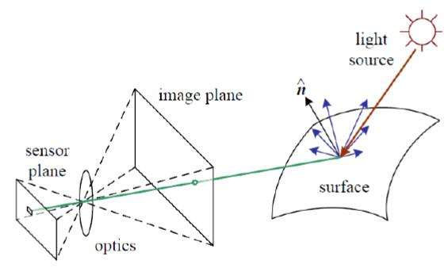
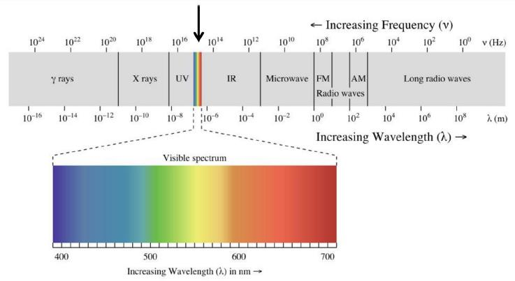
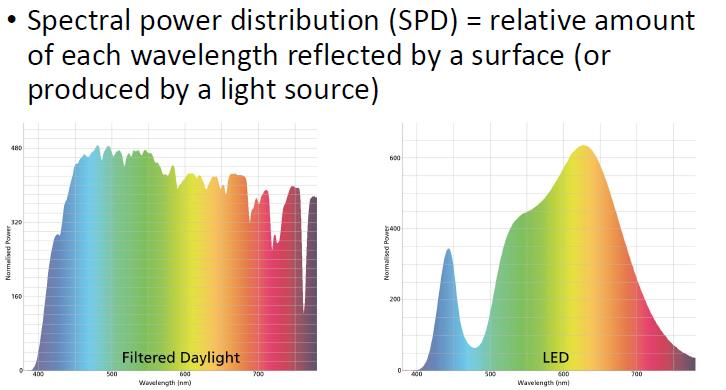
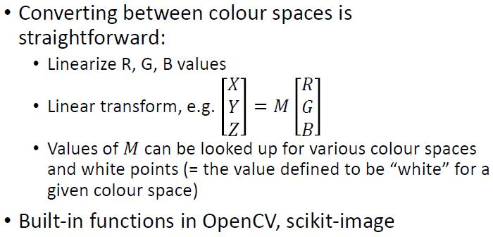
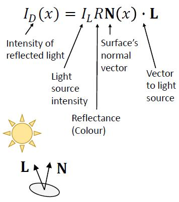
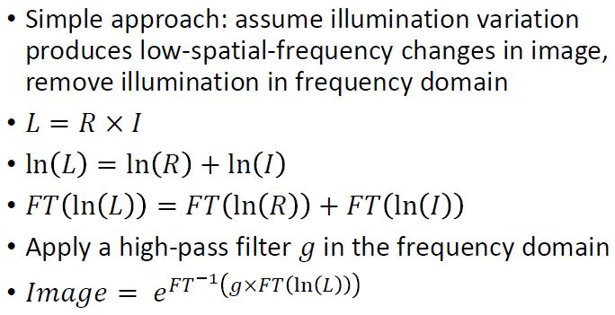
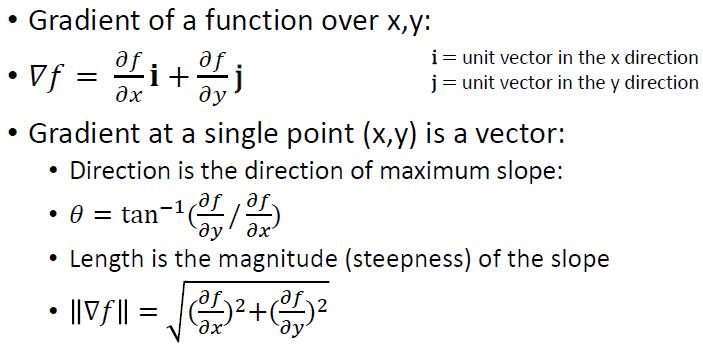

# 3 - Light, shadow, and edges

#### Image formation

### Color

##### Visible light

#### Perceived colour: 

* Human colour perception is based on 3 types of colour-sensitive cells (cones 视锥细胞)
* Standard cameras also have 3 colour sensors, each with a different spectral sensitivity
* Most surfaces reflect a range of wavelengths, but perceived colour is a function of cone response
* Result: Many different spectra appear to be the same colour

##### Trichromatic colour response

* Sensor response = sensitivity x spectrum, integrated over all wavelengths

#### Colour representation: Common colour spaces

* RGB (red, green, blue)
  * Most common spaces for digital images
* HSL/HSV (hue (色彩), saturation, lightness/value)
  * Attempt to match human understanding of colour
* CIE 1931 XYZ
  * Based on human cone sensitivity, basis for other spaces
* LAB (luminance, a*=red/green, b*=blue/yellow)
  * Approximately perceptually uniform space

#### Colour transforms

#### 

#### Summary

* Colour is not just three values, but human eye (and standard camera) depends on just three sensors
* Many trichromatic colour spaces
* RGB most common for image storage, other spaces may be more useful for colour manipulations

### Shading and surfaces	L3.1 P22

##### Diffuse (Lambertian) reflectance

Goal of vision: Recover surface colour and normal from reflected light

##### Recovering surface normal

* Can recover angle between surface normal and light source, but not normal
* However, can add additional assumptions:
  * Normals along boundary of object are known
  * Neighbouring normal are similar

##### Shape from shading

* Recover 3D shape from 2D image based only on surface brightness (shading)
* Requires additional assumptions, no algorithm works for all cases

##### Recovering surface reflectance

* Luminance = Reflectance * Illumination

##### Reflectance from frequency

#### 

* Separating reflectance and illumination in the frequency domain:

#### Recovering surface properties

* Problems with the simple approach?
  * Some reflectance edges are smooth
  * Some lighting edges are not smooth (texture, corners)
* More sophisticated approaches (e.g., based on partial differential equations) can give better results but have similar problems
* Even more complicated in practice!
  * Lighting usually isn't uniform
  * Most surfaces aren't matte/Lambertian

##### Examples:

* Cast shadows: Change in illumination, not change in surface

* Specularity (镜面反射): Specular (mirror-like) reflection

* Anisotropy (各向异性): Anisotropic reflection caused by tiny grooves (凹槽) in surface
* Transparency: Light passes through surface
* Translucency (半透明): Light passes through but is scattered

#### Summary

* Recovering surface shape and reflectance from a single image is difficult
* Generally requires additional assumptions or constraints:
  * Assumptions about surface (e.g., matte, smooth)
  * Shape and/or lighting priors
* Images contain a lot of information, and it’s not easy to separate out sources

## Edges

### Edge detection

##### Causes of edges

* Surface normal discontinuity
* Depth discontinuity
* Surface discontinuity
* Illumination discontinuity

##### Characterising edges: change in intensity	L3.2 P8-9

#### 

##### Partial derivatives: x->vertical edges	y->horizontal edges

##### Issue: noise	L3.2 P13-15

* Smooth (blur) first
* More efficient: Associative property of convolution

##### Sobel	L3.2 P16-18

### Canny edge detection	L3.2 P21

* Foundational approach to edge detection
* Detect edges based on image gradient, then do additional processing to improve the edge map

* Filter with derivative of Gaussian filters
* Get magnitude, orientation of all the edges
* You really only need two oriented filters (dx and dy)

#### Non-maximum suppression	L3.2 P28

* If nearby pixels claim to be part of the same edge, only keep the one with maximum gradient.
* Bin edges by orientation
* For each edge pixel
  * Check the two neighbour pixels orthogonal to this edge pixel
  * If either neighbour has same edge orientation AND higher magnitude, this pixel is not an edge

#### Thresholding with hysteresis (滞后)	L3.2 P31

Problems: low-contrast edge/shadow

No single threshold will work: use hysteresis

* Two thresholds T1, T2 with T1 > T2
* Strong edges: magnitude > T1
* Weak edges: T1 > magnitude > T2
* For each weak edgy:
  * Check the 8-pixel neighbourhood around this pixel
  * If any neighbour is a strong edge, relabel the weak edge pixel as a strong edge
* Final edge map = strong edges

#### Summary

* Canny edge detector: commonly used algorithm to detect edges in images
* Defines edges based on image gradient
* Post-processing of gradient to better localise edges (non maximum suppression) and preserve faint/broken edges (thresholding with hysteresis)

### Edges for image recognition	L3.2 P35

#### Compression

* Edge = discontinuity
* Efficient way to represent images: only represent points where the signal changes

#### Invariance

* Edge-based features are invariant or tolerant to many irrelevant image changes

##### Invariant to X

* Response/representation does not vary with X, is insensitive to changes in X

##### Tolerant to X

* Response is mostly insensitive to X

#### Different situations

* Light intensity
  * Image derivative is invariant to intensity shift (I' = I + b)
  * Tolerant to contrast change (I'= aI ), but depends on thresholds
* Light direction
  * Nicely tolerant
* Translation
  * Completely invariant
* Rotation
  * Same collection of edges. However not invariant, e.g. horizontal edge become vertical edge.
* Scale
  * Not invariant. Number of edges depend on scale of the image.
  * e.g. Corner in small scale may become edge in large scale.
* 3D rotation / pose
  * Somewhat tolerant. Not invariant.

#### Image recognition

* To recognize objects across variations in lighting, position, size, pose, etc.
* Learn invariant features and compare them to image
* Learn a separate set of features for each variation (e.g. 8 different rotations) and compare each one to image
* Recognition algorithms often use a mixture of both strategies

#### Summary

* Edge detection is the first step for most visual processing systems
* Edge based features have desirable properties for visual recognition
  * Compress information
  * Invariant or tolerant to irrelevant changes in the images

