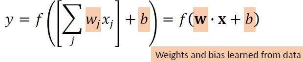
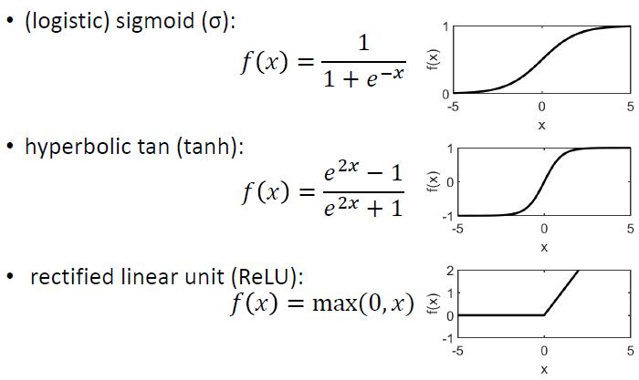
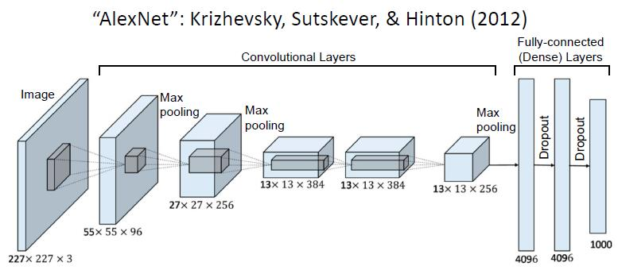
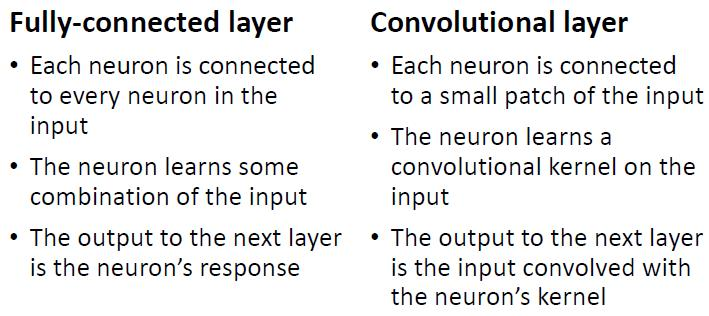
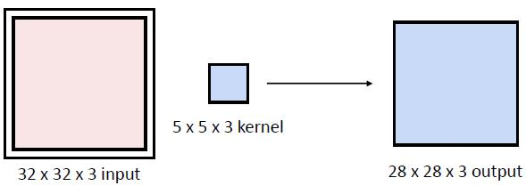
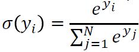
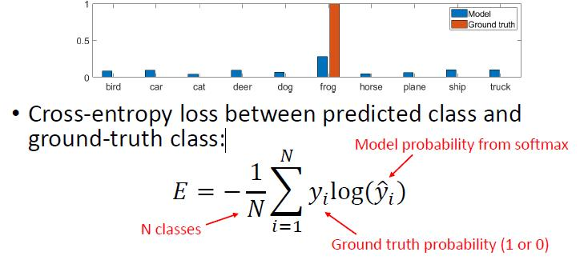

# 4 - Convolutional Neural Networks

### Recognition

* In this section, we’ll define image recognition as category level recognition of the whole image
* Category level = group level
  * Groups may be more or less specific (“bird,” “duck,” “Australian wood duck")
  * Different from instance-level recognition, recognising a specific individual
* Whole image = one label per image
  * Different from detection = locate object in image
  * Different from segmentation = label individual pixels

* Difficulties
  * Inter-category similarity 不同类别相似
  * Intra-category variability 同类别内多样
    * Instances
    * Illumination
    * Scale
    * Viewpoint/pose
    * Background/occlusion
* Goal: Build a representation of the image that
  * distinguishes different categories
  * but is invariant (or tolerant) to variation within a category
* Supervised learning problem map image to class label
* Pre-2010: small number of classes (order of 10-100), hand crafted features
* 2010-now: “large scale” image recognition (order of 1000 10,000 classes), millions of images, deep learned features

#### ImageNet

* Based on WordNet, a database of English words organised by concepts
* Class images collected online, manually cleaned by human annotators (2.5 years of annotation work)
* Over 5,000 classes, but commonly used dataset includes just 1000 of the classes with most exemplars

### Neural network review	L4.1 P19

#### Neural networks

* Multiple layers of neurons working in parallel on the same input
* MLP = multilayer perceptron
* Each neuron on layer L receives input from all neurons on layer L-1 ( fully connected layer) and produces one output
* Neuron’s output is a weighted sum of the input, followed by a non linear activation function

* Train through backpropagation (a form of gradient descent)
* Compute gradient of the loss function with respect to network parameters, starting with output layer and propagating to earlier layers, and adjust weights to reduce loss
* Learning rate is a free parameter
* Loss function usually based on difference between ground truth and prediction (supervised learning)
* Advantages:
  * Universal approximator - able to approximate any continuous function on Rn
  * Feature embedding - learns complex features
  * Parallelisable - within each layer, neurons are independent
* Disadvantages:
  * Very large number of parameters - high memory/time/data requirements, prone to overfitting

#### Non-linear activation function

#### 

### Convolutional layers

Regular neural networks can be used for image recognition, but convolutional neural networks are more common for large images.

* More efficient learning of local, repeated patterns
* However, limits what the network can learn

#### Definition of Convolutions

* A **kernel**, which is a matrix overlaid on the image and computes an element wise product with the image pixels.
* A **stride** which defines how many positions in the image to advance the kernel on each iteration.
  * Stride = 1 means the kernel will operate on every pixel of the image.

##### Demo of convolutional layer	L4.1 P33-42

#### Fully-connected vs. Convolutional

#### 

* Number of learned parameters
  * Fully-connected: Size of input + 1 bias
  * Convolutional: Size of kernel + 1 bias

#### Convolution output size

* Valid convolution (with kernel larger than 1x1) results in output smaller than input
* If same size output is needed, pad the input (zero padding is most common)

#### Kernels	L4.1 P48-51

* In layer 1, kernels mostly learn edges.
* Things learned in higher layers are very abstract.

#### Summary

* Advantages
  * Efficient: Learns to recognize the same features anywhere in the image, with fewer parameters compared to fully connected layer
  * Preserves spatial relations - output is an image with values indicating where features are present
* Disadvantages
  * Limited kernel size means model is limited to learning local features
* Convolutional neural networks - variation on standard (fully connected) neural networks
* Each convolutional layer learns a set of kernels and outputs activation maps (= input convolved with learned kernel)

### Downsampling

* It’s common to downsample convolution layer output
* Reduces output size and number of computations needed in later layers
* Can also improve tolerance to translation - small changes in input won’t change downsampled output
* Downsampling is common in CNNs to make computation more efficient in later layers and increase translation invariance.
* Methods include strided convolution, max pooling, and average pooling.

#### Strided convolution

* Convolutional stride = distance between successive convolution windows
* In CNNs, stride can be > 1
* Assuming no padding:
  * **output_size = ceil((input_size - kernel_size + 1) / stride)**
* With padding:
  * **output_size = ceil(input_size / stride)**
* Advantage: Efficient - higher stride means fewer convolution operations
* Disadvantage: Kernel window skips over parts of the image, so important image features could be missed

#### Pooling

* After convolution, each activation map is separately downsampled
* Pool stride determines the amount of downsampling (output_size = input_size / stride)
* Max pooling:
  * Within a given window in the activation map, take the highest value and discard the rest
* Average pooling:
  * Within a given window in the activation map, average the values
* Advantage
  * Max pooling is most likely to preserve the most important features, compared to strided convolution or average pooling
* Disadvantage
  * Average pooling “blurs” over features; important features may be lost
  * Pooling is slower than strided convolution

### Regularisation in CNNs

* Due to the very high number of parameters, CNNs are prone to overfitting, even on large datasets
* Regularisation is usually needed to reduce overfitting
* Common options:
  * L1 or L2 regularisation
    * Free parameters when adding regularisation:
      * How much weight to give regularisation term vs. other terms in the loss function
      * Which layers to include in regularisation all layers or just later layers?
      * Which parameters to include - sometimes only weights are included, not biases
    * Adding regularisation tends to slow down training
    * Too much regularisation can result in underfitting
  * Dropout
    * Randomly discard some neurons (set output = 0)
    * Forces neurons to find useful features independently of each other
    * Effectively, trains multiple architectures in parallel
    * What percentage of neurons to drop is a free parameter (e.g., drop 50% or drop 20%)
    * Can be applied to all layers, or just later layers
      * Different dropout percentages can be applied to different layers typically later layers would have more dropout
    * Adding dropout tends to slow down training
    * Dropout is only used in training when evaluating the network on new data (validation/test), all neurons are active
  * Early stopping
    * Stop training the network when it shows signs of overfitting
    * Monitor performance on a validation set
      * Subset of data not seen in training and not included in test set
      * During training, periodically check model’s performance on the validation - set a decrease suggests overfitting
    * Encourages smaller values for network parameters by keeping them close to their initial values (which are typically near 0)
* Frequently unclear which method (or combination) will work best for a given optimisation problem, so it’s common to experiment and combine them

### Training an Image Recognition CNN

#### Overview

* Typical architecture for image recognition:
  * Some number of convolutional layers, with downsampling
  * One or more fully connected layers
  * Softmax output with cross entropy loss
* Basic idea:
  * Do feature embedding in convolutional layers 
    * Transform images from pixels to useful high level features
  * Fully connected layers are effectively a linear classifier (or MLP) to predict class from high level features

#### Loss function

##### Softmax: 

* Apply softmax function to last layer’s output
* Produces a vector that has the properties of a probability distribution:
  * All values in range 0 1
  * Values sum to 1

##### Cross-entropy loss

* Measure of the difference between the model and ground truth probability distributions

#### 

#### Training process

* Split data into train/validation/test sets
* Split training data into batches
* Initialise network weights and bias
  * Typically, weights initialised to small values from a Gaussian distribution around zero
  * Bias initialised to zero or small positive values
* **Set training parameters**
  * Batch size
  * Optimiser
  * Learning rate + decay
* For N = 1 - ?
  * Preprocess a batch of image data
  * Classify batch, compute loss
  * Update model parameters with back propagation
* Monitor training and validation loss
  * Periodically check trained model’s performance on the validation set (for early stopping)
  * Stop training when validation loss no longer decreases
* Generally, train until model’s performance on a validation set stops improving

#### Data preprocessing

* Image whitening scale each image to 0-255 range, then normalise so each pixel has mean=0 and (optionally) std=1
* A per-channel mean also works (one value per RGB)

#### Data augmentation

* Manipulate training data to generate more samples
* Without data augmentation, even smaller networks (e.g., AlexNet) overfit to ImageNet
* Common options:
  * Random crops (e.g., 224 x 224 from 256 x 256 images)
  * Horizontal reflection
  * Small colour/contrast adjustments (to simulate different camera settings or times of day)
* Less common:
  * Random rotation (e.g., +/ 15 degrees) -> slow
  * Random scale -> slow
  * Random occluders (限光器)
* Variations such as vertical reflection and large colour changes are not suitable since they are likely to change the original features.

#### Batch size

* Batch size (or mini batch size) = portion of the training data used to compute gradient for parameter update
* It’s not computationally feasible to use the whole dataset to compute each update
* Dataset is randomly split into N batches of size b
* N updates = 1 epoch (every image has been seen once)
* Smaller batch size
  * More updates (but these are faster to compute)
  * Noisier updates (high variance in gradient)
* Larger batch size
  * Fewer updates (but each update takes longer to compute)
  * More stable updates
* In practice, batch size tends to be limited by memory constraints

#### Optimiser

* Stochastic Gradient Descent (SGD)
* Root Mean Square Propagation (Rmsprop)
* Adaptive moment estimation (Adam)
  * Keep a moving average of the squared gradient / gradient to divide the learning rate
  * Different from SGD that maintains a single learning rate for different gradients with different magnitudes

#### Learning rate + decay

* Learning rate = how much to change network parameters on each update
  * Too high - rate unstable training
  * Too low - rate very slow learning

#### Summary

* Training CNNs can be difficult - parameter space is extremely large
* Data augmentation is usually required to avoid overfitting
* Hyperparameters (batch size, optimizer, learning rate) can affect how well the network learns

### CNN results	L4.2 P43

* CNNs are the state of the art for image classification, exceeding human performance on ImageNet
* CNN classification errors are often understandable (odd views, small objects), which suggests they learn reasonable features for this task
* But they do show some odd failures, like poor generalisation to ImageNetV2

