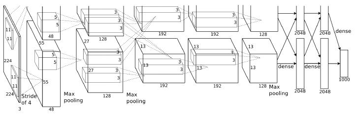
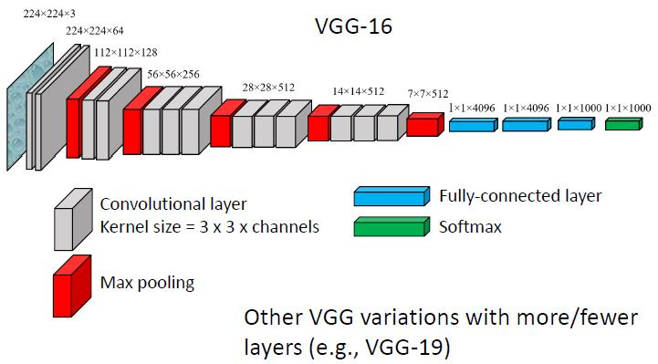
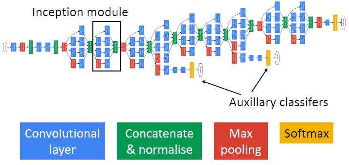
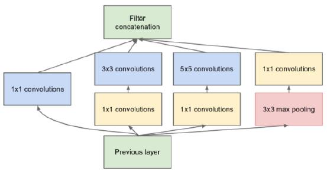
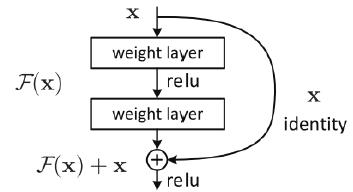

# 5 - Deep Learning I

### Common architectures

#### AlexNet

##### Innovations

* ReLU (Rectified Linear Unit) activation function - faster training
* Training on GPU - parallelisation allows faster training (actually required 2 GPUs at the time!)
* Overlapping max pooling regions, response normalisation after ReLU - small accuracy increase
* Data augmentation reduces overfitting
* Dropout reduces overfitting

#### VGG

##### Innovations

* Stacked 3x3 convolutional layers
  * VGG stacks multiple 3 x 3 convolutional kernels to effectively make larger kernels:
    * Two 3 x 3 conv. layers = effective receptive field of 5 x 5
    * Three 3 x 3 conv. layers = effective receptive field of 7 x 7
  * Learn more complex features thanks to additional non-linearities
  * Fewer parameters than 1 layer with the equivalent receptive field
* Doesn’t use AlexNet’s response normalisation allows faster training with only very small accuracy drop

#### GoogleNet (Inception)

##### Innovations

* Inception module
  * Choosing the right kernel size in CNNs is difficult because objects/features can appear at any scale
  * Solution: use multiple kernel sizes and concatenate
  * Learns features at a variety of kernel sizes/scales
  * 1x1 convolutional layers reduce the number of channels (dimensionality reduction)

* Auxillary classifiers
  * Used during training only - classify images based on early layer representations and update parameters
  * Helps with vanishing gradient problem

#### ResNet

* Will deeper neural networks will always give better performance?

  * No, performance saturates and then decreases
  * Not due to overfitting - performance is worse on the training set

* It should be possible to learn parameters in the deep network that would allow it to act like the small network

  * For example, some conv. layers learn identity kernels, while others learn the shallow network’s kernels

* However, deep CNNs cannot learn this solution (at least, not within a reasonable training time)

* Solution: Add “shortcut connections” that skip some layers

* Residual learning - Reformulate the learning problem:

  * Traditional network: input 𝑥, output ℋ(𝑥), which is the feature representation of 𝑥
  * Residual network: input 𝑥, learn ℋ(𝑥) − 𝑥, which is then added to x to get ℋ(𝑥)
  * Makes it easier to learn identity mapping

* Residual block

  * Simplifies the learning problem by making it easier for networks to learn identity mapping
  * Allows deeper networks to improve accuracy

  

#### MobileNet

* Lightweight architecture for mobile apps
* Separable filters
  * Recall that filtering with a 2D filter is equivalent to filtering with two orthogonal 1D filters
  * Similarly, filtering with a 3D filter is equivalent to filtering with a 2D filter and an orthogonal 1D filter
* Depthwise separable convolution
  * MobileNets uses depthwise-separable filters - 2D filters in x,y and 1D filters over channels
  * Fewer parameters and less computation
  * Limits what kernels the model can learn not - all kernels are separable
* Smaller and faster than other architectures
  * Lower accuracy than VGG, ResNet, etc.
  * But better suited for real time applications, phones

##### Choice of architecture depends on your application

* Runtime, memory, processing power

#### Classification results	L5.1 P26-28	L5.2 P6

* Objects that are larger in the world are easier to recognize
  * Possibly because the background is consistent for large objects
* Natural objects are more easily recognized than man-made
* More highly textured objects are more easily recognized

##### ImageNet classification

* 1000 object classes
* Model output = a probability distribution (from softmax) over 1000 class labels
* Top-1 accuracy
  * For each test image, model is correct if the most likely class == ground truth class
* Top-5 accuracy
  * For each test image, model is correct if any of the 5 most likely classes == ground truth class

##### Generalisation

* Features from neural networks are good representations for a range of tasks

##### Summary

* CNNs are the state-of-the-art for image classification, exceeding human performance on ImageNet
* CNN classification errors are often understandable (odd views, small objects), which suggests they learn reasonable features for this task

### Transfer learning

##### Pixels are a poor space for classification

* High dimensional space: 256 x 256 x 3 image = 196,608 attributes
* Irrelevant transformations (translation, lighting change, scale change, rotation, etc.) cause large changes in pixel values

##### A good feature space for image recognition

* Is lower dimensional e.g., 1000s of values per image
* Projects images from the same class into a similar part of the space (images with the same class label have similar features)

##### Using pretrained networks

* CNNs convert images from pixels to high level features that are good for classification (feature embedding)
* These high level features give good performance on a range of computer vision tasks
* Transfer learning - use features from a CNN trained on a large scale task (e.g., ImageNet classification) as input for another task, with minimal retraining

#### Transfer learning

* Embedding of an input = the network’s response to the input at some layer

* Extract the representation from a late layer of a CNN trained on ImageNet
  * E.g. For each image take the activations from the 4096 neurons that feed into the 1000 way ImageNet classification
* Use the neurons’ activations as the attributes for a classifier of your choice (e.g., SVM, K-NN etc.)
* More efficient: Remove the output layer of a CNN trained on ImageNet
* Replace with an appropriate output layer for your task
* Intialise your new layer and train only this layer; freeze all other network parameters
* Or, optionally, train some of the later layers but freeze earlier layers

#### Retraining layers

* Finetuning = retraining layers of a pretrained CNN
* How many layers to fine tune depends on dataset size and how similar it is to ImageNet
  * More dissimilar datasets may need more retraining of lower layers
  * If dataset size is limited, training lower layers may just lead to overfitting

#### Summary

* ImageNet trained CNNs produce state-of-the-art performance on image recognition tasks
* It’s common to use CNNs pretrained on ImageNet for a variety of computer vision tasks, either as is (“off the shelf” feature embedding) or with some finetuning

### Model visualisation

#### Visualising feature space

* How are images organised in this feature space?
* It’s a high dimensional space, so we can’t just plot all images in this space
  * Can use dimensionality reduction
    * PCA (principal component analysis)
      * Show the dimensions with the most variance
      * Simple but often hard to interpret since only a few dimensions can be visualised simultaneously
    * t-SNE (t-distributed stochastic neighbor embedding)
      * Flatten high dimensional data into 2D or 3D so that near neighbours stay nearby
  * Or look at local regions (what images are near neighbours in this space?)
* Look at individual neurons

#### Visualising convolutional kernels

* Visualising the first convolutional layer kernels is easy because the input channels are RGB
* Visualising layer conv kernels is harder because the channels are high dimensional and represent complex features

#### Maximally activating patches

* Choose a layer and channel
* Run many images through the network and find patches that give the highest response in this channel

#### Guided backprop

* Compute gradient of neuron value with respect to image pixels
* Which pixels matter most for correct classification?
* ReLU activation function means neurons with response < 0 are set to 0
* Traditional backprop does not pass back gradient when neuron response is 0
* Guided backprop also does not pass back negative gradient

#### Visualising image regions

* What parts of an image are most important for determining the class label?
  * Can help show what features the model uses to determine class
  * Can help debug problems (e.g. using background to classify object, label confusion when there are multiple objects)
* Occlusion method: mask image and see how much class probability changes    L5.2 P19

#### CAM (Class Activation Mapping)	L5.2 P20

* Add a Global Average Pooling (GAP) layer before classification layer, use weights of this layer to determine where the class relevant features are.
* Disadvantage
  * Most models don’t use GAP, so the GAP layer must be added to a pretrained network and then finetuned
  * Only allows visualisation of the last layer
* More flexible alternative: Grad-CAM (Gradient-Weighted Class Activation Mapping)

#### Grad-CAM	L5.2 P23

* Take response from some layer A∈ℝ𝐻𝑥𝑊𝑥𝐾
* Compute gradient of class score with respect to layer response
* Global Average Pool (average over image x,y) the gradients to get a vector of weights 𝛼𝑘 (1 weight per channel)

* Compute activation map 𝑅𝑒𝐿𝑈(sum(𝛼𝑘𝐴ℎ,𝑤,𝑘))

#### Visualising classes

* Usually based on gradient ascent - synthesize image that maximises class label response
  * Initialise an image with zeros or small random noise
  * Run image through network, compute gradient
  * Update image pixels in a direction that minimises loss
* Problem: there are many possible arrays of pixels that can generate very high model response; not all of these will look like realistic images

#### Summary

* Various ways to visualise what a model is doing
  * Feature space visualisations
  * Visualising image regions that support a class decision
  * Class visualisations
* Each method provides different information, so it’s usually best to try multiple approaches

### Invariance & generalisation

#### Invariance / tolerance

* Lighting, Translation, Image plane rotation, Scale, 3D rotation / pose

* BagNet shows most informative patches	L5.2 P33

* CNNs are tolerant to variation included in the training data
* But often not tolerant to variation that didn’t appear in the training data
* Classification tends to rely on recognizing a few key features / local texture elements

#### Shape and texture

* VGG-16, trained on ImageNet
* The performance drops from 90% to 79% on texturised images.

#### Adversarial images	L5.2 P39

* Adding small amounts of noise to an image can completely change the model’s perception

#### Generalisation	

* Models are very sensitive to some types of noise    L5.2 P36
* ImageNet vs. ImageNetV2   L5.2 P40
  * Drop of about 10% suggests some overfitting to quirks of ImageNet

#### Summary

* ImageNet-trained features are used for a variety of visual tasks
* But ImageNet-trained CNNs have some issues:
  * Very sensitive to noise
  * Recognize local texture features but not global shape
  * Generalisation errors on very similar datasets
  * Biases due to dataset construction
    * Geographic bias	L5.2 P41

