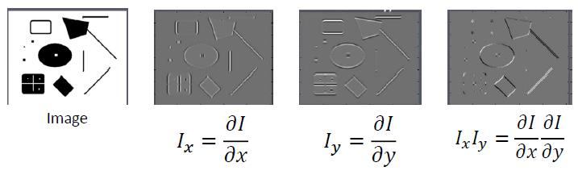

# 6 - Feature-matching

### Local features

#### Approach to recognition

* Detect local features, ignore spatial position
  * Example: bag of words / bag of features	L6.1 P12
    * Based on the method from NLP represent a document using a histogram of word frequency
    * In an image, “words” are local features
    * Problem: in images, the same “word” can have many appearances
    * Solution: combine similar local features, e.g., with k-means clustering
    * Bag of words/features = detect local features anywhere in the image, ignore location and spatial relations
* Local features + weak spatial relations
  * Spatial pyramid models	L6.1 P17
    * Main idea: run bag of features at multiple scales -> Multiscale pooling
    * Note that there’s a difference between:
      * Detecting features at one scale and pooling at multiple scales
      * Detecting features at multiple scales
    * Spatial pyramids add weak spatial relation information to the “bag of features” approach
* The above two methods generally works well for category-level recognition and have high invariance to object translation and pose
* Detect local features and model spatial relations between them
  * Deformable parts models
  * Keypoint tracking / matching

#### Feature detection

##### Dense vs. sparse features	L6.1 P24

* Dense feature representation: compute local features everywhere
* Sparse feature representation : compute local features only at a few “important” points

##### Feature detection: finding “important” points (interest points or keypoints ) in images

* Generally, points that can be detected reliably across image transformations

##### Feature descriptor: a short code or set of numbers to represent a point in an image

##### Selecting good keypoints

* Should be easy to recognize in a small window
* Shifting the window in any direction should produce a large change in intensity

#### Corner detection	L6.1 P30

* Change in appearance of window w(x,y) for the shift [u,v]:

* Common window functions: square, Gaussian

* Approximate shifted intensity using Taylor series:

#### 

##### Corner response function

##### Harris corners	L6.1 P39

##### Invariance / tolerance

* Corner detection is based on the image gradient (edges), so it’s
  * Invariant to translation
  * Tolerant to changes in lighting
* Because the corner response is based on eigenvalues, it is invariant to image plane rotation
* Not invariant to scale!

##### Alternatives to Harris corners	L6.1 P44

##### Summary - Corner detection

* Rather than detecting local features everywhere, feature detectors can be used to find “important” points (interest points or keypoints)
* Common type of interest point = corners
* Corners can be detected from local gradients

#### Feature descriptors

* Having found keypoints in an image, we need a way to represent them
* Options:
  * Image patch
  * Handcrafted descriptors
    * SIFT
    * GLOH
    * BRIEF
    * BRISK
    * ORB
  * Machine learned descriptors

##### Scale-Invariant Feature Transform (SIFT)	L6.1 P48

* Compute gradient, take histograms in a grid of pixels around interest point
* Weight gradient magnitudes based on distance from centre of patch
* Normalise histograms to sum to 1
* SIFT implementation details:
  * Patch size = 16 x 16 pixels
  * Grid = 4 x 4 cells
  * Histogram bins = 8 orientations
  * Gaussian weighting from centre of patch
  * Two step normalisation: normalise to sum to 1, truncate values to 0.2, normalise to sum to 1
* Descriptor length = 4 x 4 x 8 = 128
* Interest points (blobs) are detected at multiple scales; descriptor is based on the scale with maximum response
* Histograms are encoded relative to the main orientation in the patch

##### Summary - Feature descriptors

* Feature descriptor = a code to represent a local patch or interest point in an image
* Many handcrafted feature descriptors, with different:
  * Encoding method
  * Speed
  * Descriptor size
  * Feature detection method
* Goal of feature descriptors is invariance, so points can be matched reliably across image transforms

#### Summary - Local features

* Most recognition approaches are based on local features, but differ in how they represent spatial relations between features:
  * Bag of features methods: no spatial information
  * Feature detection methods: precise spatial information
* Choice of approach depends on task
  * Spatial information is probably not needed for category level recognition
  * Spatial information is useful for tasks that require matching structures across images

### Feature matching

* ##### Goal

  * Simultaneously recognise object and its pose in 3D
  * Track features across multiple views

* ##### Challenges

  * Features will have different appearance in each view (due to changes in pose, lighting, etc.)
  * Some features visible in one view may be missing in the other
  * Background could contain similar “matching” features

##### Feature matching as model fitting

* Not just looking for same features, but same spatial arrangement of features
* Model fitting problem:
  * Propose a model that explains correspondence between matched points
  * Find points that fit model / measure goodness of fit / find model parameters
* Problems:
  * Outliers (data not explained by model)
  * Noise in data that is explained by model

#### Hough transform	L6.2 P10

* Each edge point “votes” for the lines that pass through that point
* Identify lines with the most “votes”
* Identifying the parameters with most votes is easy if there is no noise in point locations
  * Usually there is some noise
  * Solution to noise: bin parameters
  * Points vote for bins
* Another problem: slope and intercept (m,b) are unbounded
  * Solution: use a polar representation of (m,b)

##### Hough transform parameters

* Bin size
* Threshold for peaks
* Number of peaks (= number of lines)
* Minimum line/segment length
* Maximum allowed gap (to treat segments as the same line)

##### Summary - Hough transform

* Hough transform is a method for detecting structure in images
* Each pixel “votes” for parameters
* Common applications:
  * Line detection
  * Circle detection
* Hough transform is basically a grid search over all possible values of each parameter
  * Limit to just a few parameters for efficiency

#### RANSAC

* RANSAC = Random Sample Consensus
* Like Hough transform, points “vote” for the model that explains those points
* Iteratively:
  * Sample N points at random (when N is the number of points needed to fit the model)
  * Calculate model parameters
  * Count the number of points that are explained by the model (inlier points)
* Best model = model that explains the most points

##### Demo: L6.2 P29-33

##### RANSAC parameters

* Number of iterations
  * Should be high enough that it is very likely (e.g., prob=0.99) that you will obtain at least one sample with no outliers
  * Example: Half of your data is outliers, and you want to fit a line. How many samples?
* Threshold for inliers
  * Ensure a good point with noise is likely (e.g., prob=0.95) within threshold

#### Feature matching

* Step 1. Find keypoints + descriptors in each image
* Step 2. Find candidate matches: for each keypoint in image 1, find most similar match in image 2
* Problems:
  * Many keypoints, many similar features - false matches are likely
  * For more robust matching, consider ratio (similarity to best match / similarity to second best)
* Reducing false matches

* Exhaustive matching is very slow (O(m*n)), m,n = number of keypoints in each image
* More efficient option: approximate nearest neighbours
  * Faster, but may not find the closest match
* Even with ratio matching, proportion of false matches is likely to be very high
* Step 3. Use RANSAC to find subset of matches that can be explained by a transformation model

#### Transformation between two camera views	L6.2 P41

* Affine transformation (仿射变换): any combination of translation, scale, rotation, and shear	L6.2 P43
  * Lines map to lines
  * Parallel lines remain parallel
  * Ratios are preserved
* Projective transformation combines affine transformation with a projective warp (弯曲)    L6.2 P44
  * Lines map to lines
  * Parallel lines may not remain parallel
  * Ratios are not preserved
* 2D planar transformation    L6.2 P45

#### How many points do you need to define a projective transform?	L6.2 P46

* Projective transform can include any combination of scaling, rotation, affine shift, and projective warp
* One point is insufficient to recognize any transform
* Two points - can’t distinguish between different combinations of scaling, shift, and warp
* Three points sufficient to recognize an affine only transform
  * But can’t distinguish between affine only and projective transforms
* Four points - unique solution

#### Feature matching with RANSAC

1. Randomly sample the number of points needed to fit model (e.g., 4 for projective)
2. Compute model parameter from points
3. Count inlier points

* Repeat until max iterations, take model with most inliers

#### Summary - Feature matching

* Feature matching with RANSAC finds matching keypoints across images
* Finds matching points across views, and computes the transformation that relates those points
* Applications:
  * Instance recognition
  * Video stabilisation
  * Panorama ing
  * Finding planes, vanishing points, etc. in images
  * 3D reconstruction

