# 7 - Depth and 3D

### Depth and stereo

#### Cues for depth	L7.1 P5

* 2D images contain a variety of information for depth perception
  * 2D images provide multiple cues for 3D depth (single-image and multi-image cues)
* Cues available in a single view include perspective, texture, and object cues
* More accurate depth information can be obtained by combining multiple views (stereo, motion)

#### Stereo

##### Depth form stereo

* Stereo pair: images from two cameras with a horizontal shift in camera position
* Assume:
  * Image planes of cameras are parallel to each other and to the baseline B
  * Camera centres are at the same height
  * Focal lengths f are the same
* Goal: find z
* Solve for z:
  * z / B = f / (x - x‘)
  * z = fB / x - x'
* Distance z is inversely proportional to disparity (x - x')

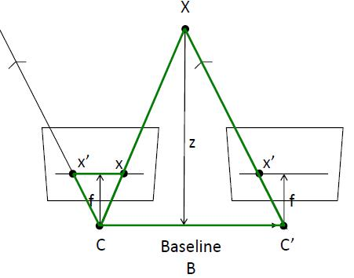

##### Basic stereo matching algorithm	L7.1 P18

* For each pixel x in one image
  * Scan a horizontal line in the other image, find best match x’
  * Compute disparity x-x’ and compute depth = (fB) / (x - x’)
* SSD / NCC

##### Effect of window size

* Smaller window = finer detail, but more noise
* Larger window = smoother depth, but lacking detail

##### Additional constraints

* Individual matches are often ambiguous

* However, the set of matches should obey additional constraints:

  * Uniqueness: a point in one view has no more than one match in the other view
  * Ordering: corresponding points should be in the same order in both views
    * Ordering constraint does not always hold	L7.1 P28
  * Smoothness: disparity values should change smoothly (for the most part)

* Applying constraints

  * Minimize E(D) using an optimisation method such as graph cuts

  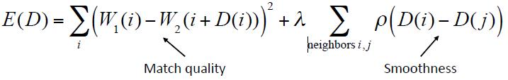

##### Rectification	L7.1 P31

* What if the image planes are not parallel?
* Rectification finds projective transform that maps each image to the same plane

##### Summary - Stereo

* Stereo depth is computed from disparity (difference in position of points in two views of a scene)
* Difficult to solve in practice because individual point matches are ambiguous
* Solution generally involves additional constraints (e.g., smoothness)

#### Single-view depth

##### Supervised depth classification	L7.2 P35

* Treat depth estimation as a classification task: For each pixel in image, predict distance from camera
* Train on images with annotated depth maps
* Loss function
  * Images may have a very large range of depths – a loss based on log(depth) may work better than absolute depth
  * Mean depth of scenes can vary widely (e.g., closet vs. stadium). To discourage models from simply learning mean depth, consider scaling the loss function so that it is similar for different scenes.

##### Depth from disparity

* Instead of training on annotated depth maps, train on stereo image pairs
* Advantage: stereo image pairs can be produced with standard cameras, while depth maps require special equipment (e.g., LiDAR)
* Input: one image from a stereo pair (e.g., left)
* Learn to predict the disparity map that will produce the other image (e.g., right)
* Distance from camera to surfaces can be computed from the disparity map
* Train on stereo pairs
* Loss is sum of:
  * Appearance loss (difference between original and predicted image)
  * Disparity smoothness loss
  * Left-right consistency loss (difference between disparity maps)

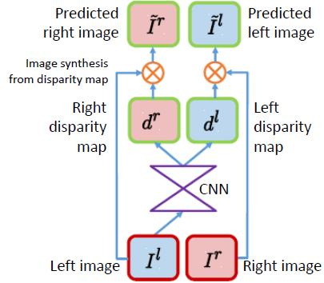

##### Summary - Single-view depth

* Machine learning methods can be trained to estimate depth from single images
* Advantages
  * Does not require multiple views / stereo camera
* Disadvantages
  * “Blurry” depth at object edges (but can be combined with edge maps for better results)
  * Models may not generalise well to new contexts
* It is possible to compute depth from single images, but more accurate depth measurements can be obtained from multiple views (e.g., stereo)

### Multi-view depth

##### Problems

* What if you don’t know the change in camera position between the views?
* What if the camera parameters (focal length, etc.) are unknown?
* Solve for:
  * Camera motion – what is the transform (camera translation + rotation) that relates the two views?
  * Camera parameters (e.g., focal length), if not known
  * Scene geometry – given corresponding image points (x, x’) in the two views, what is the position of the point X in 3D space?

#### Camera calibration	L7.2 P9

* We know how to compute 3D (x,y,z) from image plane (x,y) when imaging parameters are known
* Usually, these parameters are unknown

##### Camera parameters

* **Intrinsic parameters:** camera parameters related to image formation (focal length, optical centre, lens distortion)
* **Extrinsic parameters:** camera pose (location and orientation) relative to the world
* Camera calibration is a process to find the intrinsic parameters
* Usually, these parameters are learned from image data with unknown extrinsic parameters

##### Homogeneous coordinates

* When converting between world and image points, it is often convenient to use homogeneous (or projective) coordinates
* Image points are represented with 3 values (xi,yi,zi)
* The third value can be thought of as the distance to the image plane

##### Camera calibration method

* Camera calibration requires a calibration target, a planar surface with a known pattern that is easily detected/tracked by feature detection methods
  * Common choices: checkerboard, squares, circles
* Take multiple photos (or a video) of the calibration target in many different poses
* Solve for intrinsic and extrinsic parameters

##### Projection model	L7.2 P16

* The pinhole projection model can be represented as a matrix in homogenous coordinates
* Relationship between points in the world and points in the image:

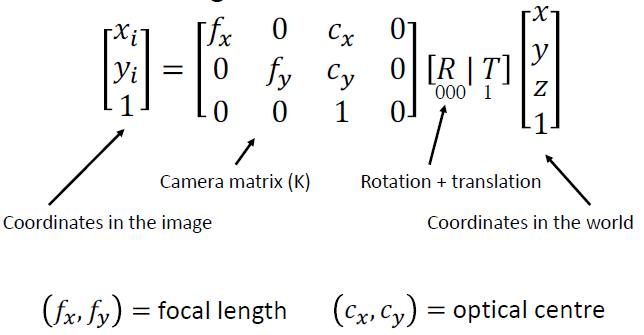

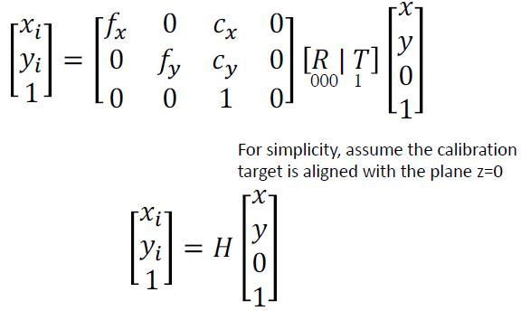

##### Camera calibration algorithm

* Given multiple images, can solve for H, and camera matrix using a system of linear equations
* Note that this model assumes no lens distortion
* Given best fit for H, estimate distortion parameters (different formulas for different distortion models)
* Iterate to refine parameters
* Result
  * Output of calibration process is an estimate of camera intrinsic parameters (camera matrix, lens distortion parameters)
  * Allows for accurate mapping between image coordinates and world coordinates
* Alternative methods
  * Calibration using planar surfaces in the world
    * Advantage: no need for a special calibration target
    * Disadvantage: more difficult to detect/track keypoints, may introduce errors
  * Look up camera parameters from manufacturer specifications
    * Advantage: no computation
    * Disadvantage: only for cameras with fixed focal length

##### Summary - Calibration

* Camera calibration is used to recover a camera’s intrinsic parameters, expressed as a camera matrix
* Calibration is required for applications that involve accurate mapping between world and image points (e.g., augmented reality)

#### Epipolar geometry	L7.2 P22

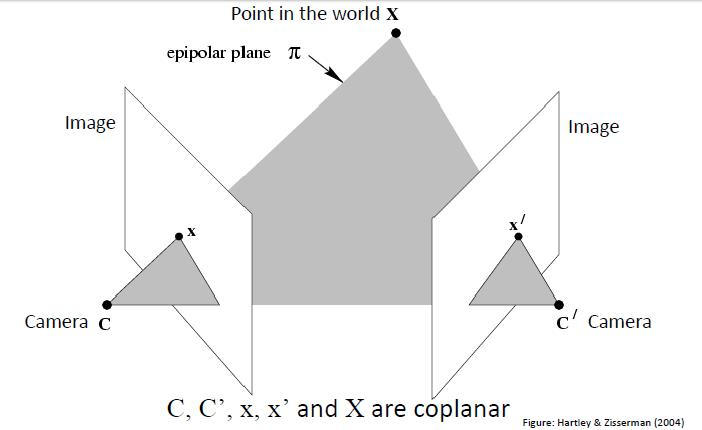

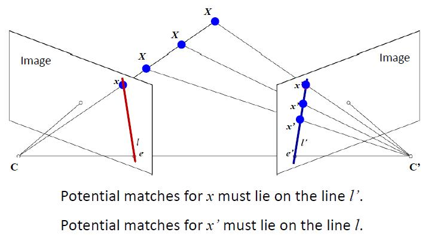

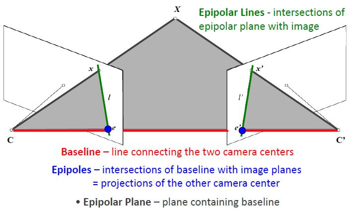

##### Examples	L7.2 P28-32

* Horizontal motion
* Forward motion
  * Epipole has same coordinates in both images
  * Points move along lines radiating from epipole e (called the “focus of expansion”)

##### Summary - Epipolar geometry

* Epipolar geometry describes relations between points in two views
* A point in one image lies along an epipolar line in the other image
* Epipolar lines in an image meet at a point called the epipole
* The epipole is the projection of one camera in the other image

#### Epipolar geometry - math	L7.2 P34

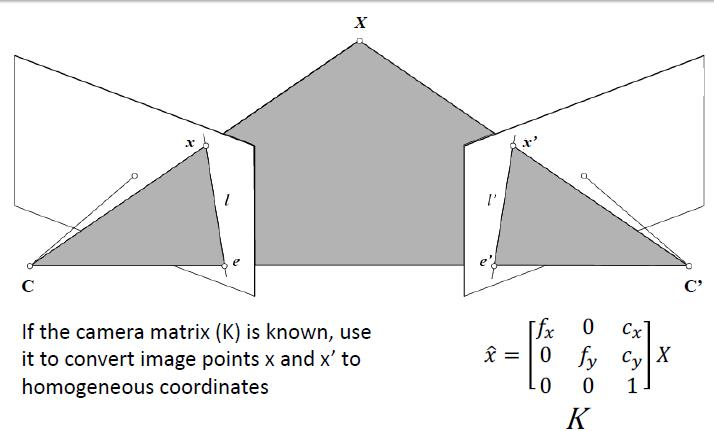

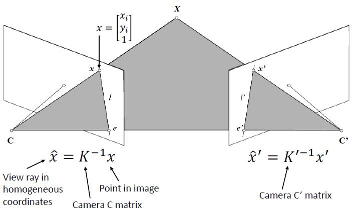

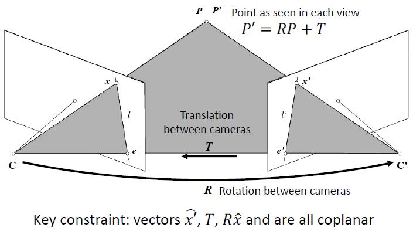

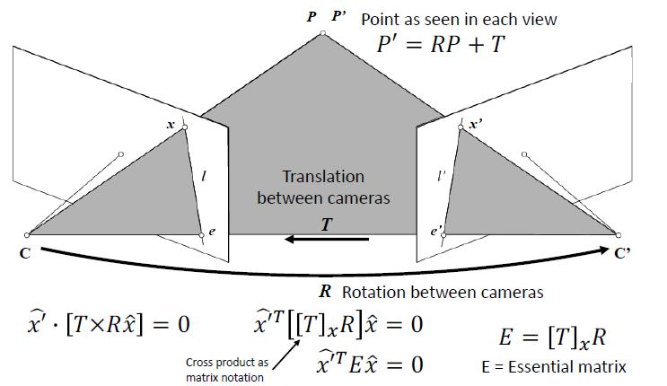

##### Properties of Essential matrix

#### 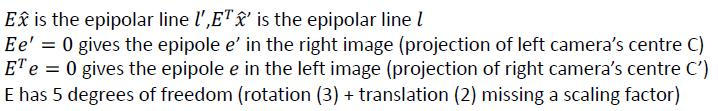

##### Fundamental matrix

* Camera parameters are unknown (uncalibrated cameras)
* Can define a similar relationship using the unknown K and K’:

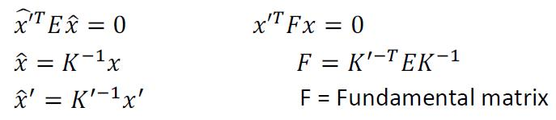

* Properties

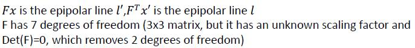

##### Solve F when K and K' are unknown	L7.2 P44

* Match pairs of points across views and find matrix F that explains the correspondences
* 8-point algorithm
  * Requires 8 matching points
  * Solve for F as a linear system of equations
  * Additional steps (SVD = singular value decomposition) to ensure that F has the correct form

##### 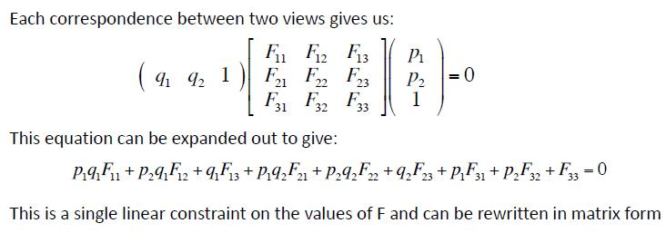

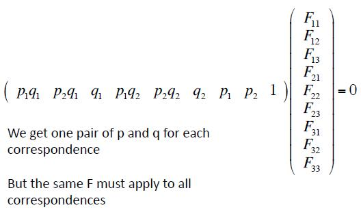

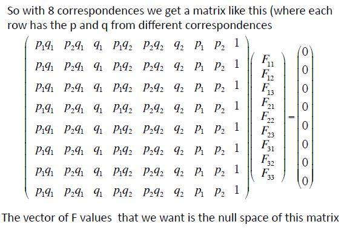

##### Limitations

* System is only solved up to a scaling factor, need at least one known distance to solve for real-world positions
* Degenerate cases: can’t solve if the system has too few degrees of freedom
  * Points in the world are all coplanar
  * Camera translation = 0 (just rotation)

##### Example: Refining GPS locations

* Google Streetview GPS coordinates are not always exact – refine locations using epipolar geometry
* Algorithm:
  * Detect ASIFT (affine-invariant SIFT) keypoints in each image, find potential matches using ratio test
  * Use RANSAC to find the Fundamental matrix (F) that relates the two views, and the inlier matches that are explained by that transform
  * Compute Essential matrix (E) from F using known camera matrices
  * Decompose E into rotation and translation between cameras

#### Summary - Epipolar geometry

* Epipolar geometry describes how a point in 3D space is imaged through a pair of cameras
* Essential and Fundamental matrices map points in one image to a line (epipolar line) in the other image
* Typically, use feature detection to find matching points in the two views, then solve for Fundamental matrix (e.g., using RANSAC)
* Beyond two-view geometry:
  * Better depth results can be obtained by combining more than two views:
  * Structure from motion
  * Simultaneous localisation and mapping (SLAM)