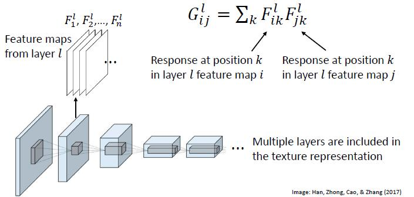
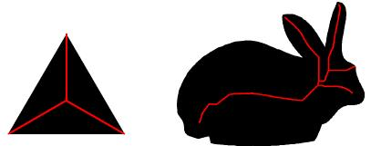
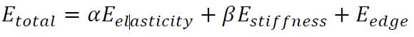
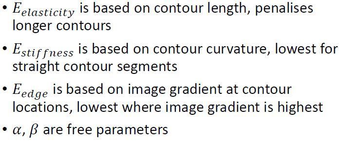
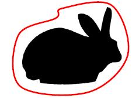

# 8 - Texture and shape

## Texture

#### Definition

* A definition from image processing: Texture is an region with spatial stationarity (same statistical properties everywhere in the region)
* A definition from computer graphics: Texture is a 2D surface applied to a 3D model

#### Types of texture

* Periodic texture - has a subregion that repeats in a regular pattern
* Stochastic (aperiodic) texture - generated by a random process

#### Texture models

* Parametric models: represent texture with a set of adjustable parameters
* Non parametric (stitching) models: represent texture as image patches

#### Why model texture

* Texture synthesis create more of a texture
  * Textures for computer graphics, video games, etc.
  * Image inpainting
* Texture transfer
  * Artistic effects
  * Online shopping

### 

### Non-parametric texture synthesis

1. Randomly sample a small (e.g., 3 x 3 pixel) patch from the original image
2. Spiral outward, filling in missing pixels by finding similar neighborhoods in the original texture

* Neighbourhood size is a free parameter that specifies how stochastic the texture is    L8.1 P17

#### Image quilting	L8.1 P19

* Efficient patch based texture synthesis
* Use existing patches of texture to synthesis more texture; main problem is connecting them together without visible artefacts/seams (缝)
* “Corrupt Professor’s Algorithm"
  * Plagiarize as much of the source image as you can
  * Then try to cover up the evidence

* Algorithm:
  * Choose patch and overlap size
  * Initialize with a random patch
  * For each subsequent patch:
    * Find a patch in the original texture that is most similar to this region, considering only the pixels in the overlap region
    * Seamlessly paste in patch by cutting along a path with minimum overlap error

#### Graph cuts

* Represent neighbouring pixels as a graph
* Edge weight = overlap error
* Problem: Find path through graph with minimum total overlap error

#### Image inpainting

* Similar idea to fill in missing regions of an image:
  * Find a similar patch in another image
  * Paste in patch with an error-minimizing cut

### Parametric texture synthesis

* Alternative to stitching approaches: represent texture with a number of parameters
* To synthesize texture, coerce (强制) a noise image to match the required parameters (usually through gradient descent)

#### Fourier texture synthesis

* Synthesize texture by matching Fourier magnitude
* Okay results for some simple textures, but doesn’t work well in general

#### Colour and edges

* Textures could be defined as a distribution over simple features, like colour and edge orientation at various scales
* Synthesize texture by matching the distribution

#### More complex statistics

* Simple distributions of features are not sufficient

* Also need to represent feature co-occurrence

* The set of statistics needed to represent real images may be very complex

* Instead of modelling statistics by hand, represent texture as the feature response in the layers of a neural network trained on ImageNet classification

  * Feature correlations: Texture is represented as the correlations between feature maps at a layer of the neural network:

  

### Summary - Texture synthesis

* Non parametric texture synthesis is based on copying texture patches
  * Works very well on periodic textures
  * Disadvantage: No model of texture parameters
* Parametric texture synthesis represents textures in terms of a set of parameters
  * Most methods work better on stochastic textures
  * Disadvantage: Even very complex models (e.g., based on neural networks) may be incomplete

### Texture transfer

* ##### Render an image in the style of another image	L8.1 P42

#### Neural style transfer algorithm

* Both images (content, style) are run through a VGG network trained on ImageNet
* Content is represented as the responses from a layer of the neural network
* Style is represented as the correlations between feature maps at a layer of the neural network
* Use gradient descent to find an image that matches both content and style

* Style transfer parameters
  * Loss is sum of loss from content reconstruction and style reconstruction
  * Relative weight of content vs. style is a free parameter
  * Content and style can be matched at any combination of layers
  * Generally, match content at higher layers, and style across all layers

### Summary - Texture

* Texture can be defined in different ways, but generally captures 2D/surface aspects of an image
* Texture representations are useful for texture synthesis and texture transfer
* Applications:
  * Image inpainting
  * Computer graphics
  * Art

## Shape

##### Models of 2D shape are usually based on either:

* The bounding contour of the shape (segments, angles)
* The internal structure of the shape (branches)

### Shape skeletons	L8.2 P7

#### Topological skeleton = thinnest possible version of a shape

* Formed of lines that are equidistant from the boundaries of the shape

* Geometrical description:    L8.2 P9
  * The skeleton points are the centrepoints of the largest discs that can be fit inside the shape
  * If the shape was painted with a circular brush (of variable radius), the skeleton would be the path of the brush
* Skeletonisation algorithm    L8.2 P10
  * Grassfire transform - algorithm for shrinking or thinning a shape
  * For each pixel within the shape, compute distance to closest boundary; peaks in the distance map are the skeleton

* Skeleton representation
  * Skeleton + distance to boundary at each skeleton pixel is a compact, invertible representation of shape
  * To “inflate” skeleton, place a disc at each skeleton pixel (radius = distance to boundary at that pixel)
* Application: 
  * Shape recognition
    * Shape skeletons are easily converted to graphs
    * Graph representation can be used for shape matching, pose recognition
  * 2D -> 3D
    * Shape skeletons can also be used as the basis for a simple 3D model – just “inflate” with spheres instead of disks
* Drawbacks to skeletons    L8.2 P18
  * Shape must be segmented from background
  * Small changes in shape boundary produce large changes in skeleton

#### Summary - Shape skeletons

* Shape skeletons represent the internal structure of shapes
* Skeleton representations work well to model shapes that have a skeleton like structure
  * Human/animal figures
  * Written characters
  * Paths/networks (e.g., city roads, blood vessels (血管))

### Contour representations

#### Active contours

* Parametric model that fits itself to object boundary

* “Shrink wraps” around object to capture shape

* Initialise contour outside object boundary

* On each step, allow each point on the contour to shift 1 pixel in any direction:

  * Shift to minimize a loss (or energy) function:

  

  

* Repeat until loss does not change

* Active contours are used for segmentation and tracking, particularly in medical image analysis

* Drawbacks: 
  * Requires initialisation (often from a human annotator)
  * May not fit shape correctly
    * Trade off between elasticity/smoothness and edge-matching - may fail to fit concavities in complex shapes
    * Difficult to detect shapes in clutter

#### Summary - Contour

* Active contours fit a shape boundary
* Tries to find an optimal shape which is both well fit to the edges and fairly simple (smooth, compact)
* Works well to segment objects with uniform appearance, moving objects

### Face models	L8.2 P31

* It’s difficult to develop a general purpose model of shape that can represent all possible shapes well
* However, it is possible to develop parametric models for particular classes of shape
* One very widely studied class of shapes is the human face

#### Eigenfaces	L8.2 P32

* If faces are aligned, pixel luminance values are sufficient to capture face shape
* Simple pixel based model: eigenfaces
* Each face is represented as a vector to the mean face image
* Parameters of face shape are obtained from PCA of face vectors
* Problem: Usually we can’t assume faces appear in consistent alignment (or consistent lighting)
* To model faces under real world conditions, we need models that can consider shape/pose

#### Active appearance models	L8.2 P36

* Label corresponding landmark points in each image
* Warp images onto the mean shape to get shape-free texture
* Obtain “shape,” “texture,” and “appearance” (shape+texture) parameters through PCA
* To fit the model to a new face, use gradient descent to minimize difference between model and image
* Applications: face synthesis, face segmentation
* Active appearance models separate shape and texture
  * Allows alignment of facial features, even when images are not aligned
* Problem: Shape is represented using 2D contours
  * Can’t separate face shape vs. pose
  * Can’t separate surface colour vs. lighting

#### 3D face models	L8.2 P40

* 3D version of active appearance model: morphable (形变) 3D mesh + texture map
* Parameters based on PCA of a large 3D dataset
* Gradient descent to match 3D shape, texture, and lighting to original image
* Application: Facial recognition
  * Most recognition algorithms use a shape model to align faces as a first step
  * Once faces are aligned, a standard CNN pipeline can be trained for face recognition
  * Alignment is critical for CNNs
    * Make it easier to design CNNs, no need to accommodate for different poses and only focus on texture
  *  

#### Summary - Face models

* Face models are one of the main applications of shape representation in computer vision
* Current state-of-the-art algorithms are based on 3D face models
* Applications:
  * Facial recognition
  * Computer graphics (movie CGI, video games)
  * Zoom filters

### Summary - Shape

* Although shape is not required for category level object recognition, shape is important for fine grained recognition and separating out effects of lighting and pose
* 2D shapes are typically represented in terms of skeleton structure or bounding contours
* 3D shape models have been developed for specific recognition problems (mainly faces and body pose)

