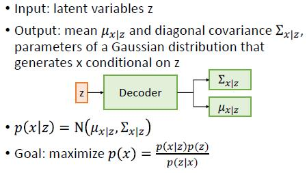
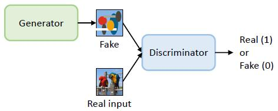

# 9 - Image generation

### Generative vs. discriminative models

#### Discriminative models

* Learn conditional probability of class Y given attributes X: p(y|x)
* Input is an image
* Output is a probability density function over labels p(y|x)

#### Generative models

* Generative models can generate new samples from the learned distribution
* Learn joint probability of attributes X and class Y: p(x,y)
* Generative model contains discriminative model: you can use the joint probability to get p(y|x)
* AND generative can do the reverse: p(x|y)

* Conditional generative model

  * Input is a label
  * Output is a probability density function over images p(x|y)

  

* Unconditional generative model

  * Output is a probability distribution p(x)
  * What is the probability that this is an image?

  

#### Bayes' rule

#### Summary - Generative vs. discriminative models

* Discriminative models produce a probability distribution over labels, given an image
* Generative models produce a probability distribution over images, given a label (conditional) or in general (unconditional)
* Difficult problem – what makes one set of pixels more probable than another?

### Autoencoders

#### Unsupervised learning

* Learn a model for unlabeled data
* Goal is to find a model that represents the data as well as possible, usually with fewer parameters
* Uses:
  * Simpler model for another ML system
  * Form of dimensionality reduction
  * Potentially better generalization
* Like supervised machine learning algorithms, unsupervised algorithms may not work well in “raw” input spaces (text, images)
  * e.g. May not fit well. Distance(frog1, frog2) may be near to Distance(frog1, cat).
  * Because of light, pose, angle...
* Solution: Embeddings (e.g., from neural networks) might work better
  * But we have no labels to learn the embeddings for our task
  * Embeddings learned for a different task may not give a complete representation of the data

#### Autoencoders

* Essentially, neural networks for unsupervised learning (no labels)
* Sometimes called “self-supervised” learning
* Output of the network is whatever was passed to the network (e.g., an image)
* Hidden layer learns a lower-dimensional representation of the input: lower-dimensional set of features that explains the data
  * “Bottleneck” layer – smaller than the input
  * Represents the input in terms of latent variables
  * In the simplest case (one hidden layer with linear activation functions), this layer learns PCA
  * Need to be smaller than the input to form a good representation. If it has the same size as the input, it is just a copy.
  * Latent representation: Simplified representation of the input
  * Can be used as a feature embedding for other tasks
* Encoder/decoder architecture
  * Encode in a hidden layer
  * Hidden layer is smaller than the input (fewer neurons)
  * Decode to an output layer
  * Often the encoding and decoding weights are forced to be the same
* Goal: output the input

* Output and loss
  * Unlike a standard NN, the output is not a class or regression value – it’s the same type as the input (e.g., an image)
  * Activation function is chosen appropriately:
    * For a binary image, tanh or sigmoid
    * For a regular image, linear activation
  * Loss function = difference between input and output (e.g., MSE)
* Not a true generative model – no way to sample new data
  * You could “sample” by giving random latent variable values to the decoder, but no guarantee that these will produce real images

#### Variational autoencoder (VAE)

* Probabilistic version of an autoencoder: learn latent representation and sample from the model to generate new images
* Assume images are generated from some distribution over latent variables z
* Assume a simple prior p(z), e.g., uniform or Gaussian distribution
* Probabilistic decoder learns p(x|z)

* Probabilistic encoder learns p(z|x)

* Encoder and decoder are concatenated and trained jointly

* Goal: maximize the likelihood p(x)
* Loss is based on variational lower bound on p(x):

* Loss consists of two terms: reconstruction loss and regularisation loss
  * Reconstruction loss: encourages network to create output images as similar as possible to input images
  * Regularisation loss: encourages network to learn a latent representation z that is similar to the prior (standard normal distribution)

* Properties of the latent space
  * To be useful for generation, the latent space should be:
    * Continuous: nearby points in the latent space correspond to similar images
    * Complete: every point in the latent space corresponds to a valid image
  * Standard normal distribution satisfies both of these requirements
  * Use of diagonal covariance matrices ensures latent variables are independent
  * Latent space visualisation    L9.1 P43
* Applications
  * Sampling new images	L9.1 P41-42
  * Image manipulation    L9.1 P44-46
    * Given the latent-variable representation z of image x, can change values of z to create variations on x
    * Nearby points in latent space correspond to similar images (continuity requirement) and axes are independent
    * But directions in latent space may not correspond to recognizable image properties (without additional constraints)

* Advantages
  * Learn approximations of p(z|x) and p(x|z), where z is a latent variable representation of the input x
  * Can be used to generate new instances of x
* Disadvantage: Outputs often blurry
  * Because of compression
  * More recent VAEs use better image representations to reduce blur

#### Summary - Autoencoder

* Autoencoders assume images can be generated from a low-dimensional space of latent variables
* Regular autoencoder – learns latent representation to reconstruct images
* Variational autoencoder – probabilistic version of autoencoder, can sample from the latent space

### Generative Adversarial Networks (GANs)

#### GAN architecture

* Generative Adversarial Networks (GANs) are neural networks that learn to generate instances from a particular distribution (e.g., images of faces)
* Actually consist of two neural networks: a generator and a discriminator
* Training involves a sort of competition between the two networks
* GAN is a pair of networks trained together: generator creates images based on latent input z, discriminator judges whether images are real vs. fake

#### Generator

* GAN Generator doesn’t actually learn the probability distribution p(x), but learns to sample from it
* Generator input is a latent variable z with a simple prior (e.g., uniform random or standard normal)
* Generator output is an image
* Generator network learns a function to map p(z) to a distribution that approximates p(x)

#### Discriminator

* Discriminator learns to identify real inputs vs. fake inputs created by generator
* Neural network classifier with two output classes (real, fake)
* Architecture depends on task: e.g., for images the discriminator might be a CNN with several convolutional layers, followed by softmax

#### Training

* The networks are trained together on a combination of real data 𝐱 and generator input 𝐳
* Given a generator 𝐺 and discriminator 𝐷:
  * Discriminator’s goal is to correctly classify real vs. fake
  * Discriminator wants to maximize 𝐷(𝐱) and minimize 𝐷(𝐺(𝐳))
  * Generator’s goal is to fool the Discriminator
  * Generator wants to maximize 𝐷(𝐺(𝐳))
* Can treat this as a zero-sum game with the goal of finding equilibrium between 𝐺 and 𝐷

* GAN training objective is a minimax game:

* If the discriminator is too good:
  * Easily rejects all fake inputs
  * Not much information to train the generator
* If the discriminator is too bad:
  * Easily confused by fake inputs that don’t look real
  * Generator will learn a poor solution
* Training can be difficult – hard to find a balance between discriminator and generator

#### Evaluating GANs

* GAN equilibrium does not necessarily mean the GAN has found a good solution
* GAN evaluation is important, because successful training does not necessarily mean the generator’s output is similar to p(x)
* Generally check for:
  * Memorisation
  * Realism
  * Diversity
* How to tell if a GAN has learned? Ideally:
  * Outputs should not be identical to inputs (memorised training data)
    * Visualise k nearest neighbours in training dataset    L9.2 P22
  * Outputs should look like inputs (look “real” and not “fake”)
    * Evaluating realism     L9.2 P24-26
      * Gold standard: human evaluation (but this is slow and expensive)
      * Automatic methods compare responses of an image classifier (e.g., a CNN trained on ImageNet) to real vs. GAN-generated images
    * Inception score
      * Within a class, all images should be confidently classified with the correct label
      * Across classes, the GAN should produce a wide variety of confidently-classified images
      * Advantages
        * Automatic, efficient
        * Neural network responses correlate with human judgements of image quality
      * Disadvantages
        * Doesn’t require high diversity within categories
        * Sensitive to noise, adversarial images
  * Outputs should be as diverse as real data (avoid mode collapse = the generator only creates one or a few outputs)
    * The GAN isn’t just memorizing training examples
    * But does it capture all of the diversity in the training set?
    * Birthday paradox    L9.2 P31
      * Suppose a generator that can produce 𝑁 discrete outputs, all equally likely
      * Experiment: take a small sample of 𝑠 outputs and count duplicates
        * The odds of observing duplicates in a sample of size 𝑠 can be used to compute 𝑁
        * A sample of about sqrt(𝑁) outputs is likely to contain at least one pair of duplicates
    * Example duplicates    L9.2 P33
    * Most GANs tested produced about the same diversity (number of different images) as was in their training set

#### Conditional GANs

* Conditional model: learn p(x|y) rather than p(x)
* Both Discriminator and Generator take y as additional input

* If x-y pairs are available, can use the standard GAN architecture with additional input y
* What if you don’t have a dataset of real x-y pairs?
  * CycleGAN: train a pair of Generators to map x->y and y->x    L9.2 P38-40

### Summary - GANs

#### Advantages

* GANs can generate samples from complex probability distributions without actually representing the distribution

#### Disadvantages

* Can be unstable / hard to train
* Difficult to evaluate
* Even models that don’t show complete mode collapse tend to have lower-than-desired diversity

