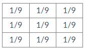
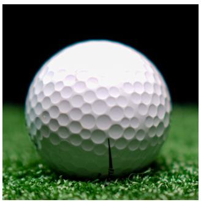
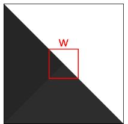
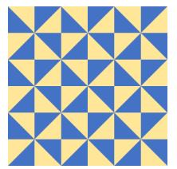
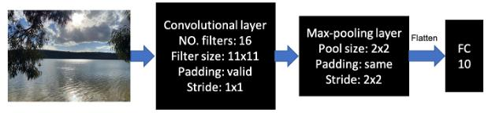
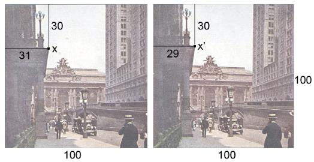
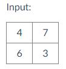
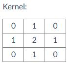

# Practice Exam

### Short response questions

Answer each of the questions in this section as briefly as possible. Expect to answer the text response questions in no more than two or three sentences.

##### Q1: Why are image borders a problem for convolution? Explain two options for handling the image borders when doing convolution. 3pts

At border pixels, the convolutional kernel will extend beyond the border of the image. 

The missing values beyond the edges of the image can be filled using options such as zero-padding, clamping, wrapping, or reflecting border pixels.

##### Q2: Why is a Gaussian filter preferred to a box filter (e.g., the filter shown below) for blurring images? 3pts

A Gaussian filter removes high spatial frequencies only. A box filter affects all spatial frequencies in the image, causing artefacts.

##### Q3: If two different objects are photographed under exactly the same lighting conditions with the same camera and produce the same RGB values, can we conclude that both objects have the same spectral power distribution? Why or why not? 4pts

The objects are not guaranteed to have the same spectral power distributions. The RGB responses are based on the integral of the camera's sensor sensitivity curve times the SPD, so the shape of the SPD could be different for each object but integrate to the same value.

##### Q4: Which of the following statements are **TRUE** of the ReLU activation function? (There may be multiple answers. Select all that apply) 3pts

It reduces the dimensions of the output of a convolutional kernel. ❌

It adds a non-linearity to the output of a convolutional kernel. ✔

It helps reduce the vanishing gradient problem, compared to other activation functions like sigmoid. ✔

It allows for faster training of deep CNNs compared to other activation functions like sigmoid. ✔

##### Q5: The Canny edge detector has two threshold parameters that must be set by the user. What is the role of each threshold? 3pts

The higher threshold detects high-contrast "strong" edges; these will be included in the edge representation. The lower threshold detects lower-contrast "weak" edges and allows them to be added to the edge representation only if they are connected to a strong edge.

##### Q6: Consider the image of a golf ball shown below. Describe two cues that can be used to infer the 3D surface shape of the golf ball from the image and explain what can be computed from each cue. 4pts											

Shading - brightness is proportional to angle between surface normal and light source, can be used to compute shape from shading

Texture - orientation of the dots on the surface of the ball can be used to estimate surface normal relative to camera

##### Q7: Assume that you have trained a deep CNN on an image dataset for classification, and you observe that the training accuracy is very high but the testing accuracy is very low. Name three possible strategies that can address this problem. 4pts

* add more training data if possible

* use a small CNN

* add dropout layer

* use pretrained network to extract features and then use a simple classifier to classify

##### Q8: Why are generative adversarial networks (GANs) prone to mode collapse? Describe a method to detect mode collapse. 4pts

GANs train to find an equilibrium between generator and discriminator, and mode collapse is a good way to achieve this equilibrium -- the generator only learns to create a few images but these few images fool the discriminator quite well. The birthday paradox test can be used to detect and quantify mode collapse.

##### Q9: Compare and contrast the region-merging and normalised cuts approaches to image segmentation. How are they similar and where do they differ? 4pts

Both methods use graphs to represent similarity relations between regions. Region-merging starts with a region-adjacency graph and combines regions, while normalised cuts starts with a fully-connected graph and finds global optimal segmentation.

### Method questions

In this section you are asked to demonstrate your conceptual understanding of a subset of the methods that we have studied in this subject.

#### Q10: Corner detection	12pts

The following questions relate to corner detection.

**(a) [6 marks]** Would the patch **w** in the image above be considered a "corner" by the Harris corner detection algorithm? Why or why not? Justify your answer in terms of the corner response function.

No, this would not be considered a corner. Shifting the window in the diagonal direction (from upper left to lower right) produces almost no change in appearance. Therefore, the matrix M will have one eigenvalue much smaller than the other, and the corner response function will be low.

**(b) [6 marks]** Is the corner response function invariant to:

* translation? - yes: the corner response function considers a local patch, it does not depend on image position in any way
* rotation? - yes: the corner response function is based on the eigenvalues of the matrix M, which are invariant to image plane rotation
* scale? - no: the response to a curved edge or circle depends on the scale; a tiny curve produces a higher corner response than a larger version of the same curve

#### Q11: Texture synthesis	15pts

**(a) [5 marks]** How does parametric texture synthesis differ from non-parametric texture synthesis? What is an advantage of each approach over the other?

Parametric texture synthesis represents a texture in terms of a set of parameters and then generates more texture by coercing random noise to have the same parameters. Non-parametric texture synthesis copy-pastes patches from an original texture. An advantage of parametric synthesis is that it builds a parameterized representation of the texture. An advantage of non-parametric synthesis is that it tends to give better results, particularly for regular textures.

**(b) [5 marks]** The non-parametric texture synthesis algorithms discussed in class (Efros & Leung, 1999; Efros & Freeman, 2001) have patch size as a free parameter. What is the effect of decreasing patch size?

Decreasing patch size results in a synthesis that looks more random than the original; texture elements will be broken up and scrambled.

**(c) [5 marks]** How would you choose an appropriate patch size to correctly synthesize the texture shown below? Be specific, referencing the image.

The patch size should be a bit larger than the size of the repeating element in the texture, so a little larger than 1/3 of the image size.

#### Q12: Object detection	15pts

**(a) [5 marks]** Briefly explain the difference between region-proposal-based and single-stage object detectors and the relative advantage of each approach.

Region-proposal-based methods select a subset of regions in the image for classification, each of which is separately classified. Single-stage methods process an entire image in parallel, providing classification and bounding box outputs for all regions. Region-proposal-based methods tend to be more accurate but single-stage methods tend to be faster.

**(b) [5 marks]** In a region-proposal-based network, how is a region of interest different from a bounding box prediction and how are they related?

A region of interest is a patch of the image which is sent to a classifier; it may not match the ground truth object bounding box. The bounding box prediction is computed from the features in the region of interest (e.g., via a linear regression or neural network regression) and should more closely match the ground truth bounding box.

**(c) [5 marks]** Why is class imbalance a problem for CNN-based object detectors? Explain how this problem is handled by a region-proposal-based method and a single-stage method.

In object detection, the "background" class is far more common than any object class. R-CNN (a region-proposal method) uses biased sampling to decrease the proportion of "background" regions in training; YOLO (a single-stage method) discounts the "background" locations so they don't contribute to classification loss.

### Algorithmic questions

In this section you are asked to demonstrate your understanding of a subset of the methods that we have studied in this subject, in being able to perform algorithmic calculations.

#### Q13	15pts

In the following CNN network, the input is a RGB image, with both height and width equal to 224. The convolution operation in the convolutional layer is standard 2D convolution (i.e., each kernel has the same number of channels of the input, and the kernel goes through local patches of the input to conduct element-wise multiplication and take sum). "FC10" denotes a fully connected layer with 10 units.

**(a) [3 marks]** Compute the size of the feature maps output by the convolutional layer and max-pooling layer (The output size should be in format of height × width × number of channels).

Conv layer: No padding, Stride=1, so width/hight of the output feature map is 224-11+1=214. Filter number is the channel of output feature map, which is 16, so the  size of output feature map is 214x214x16.

Max-pooling layer: With padding, stride = 2, so so width/hight of the output feature map is ceiling(214/2)=107, channel number does not change, so the size of output feature map is 107x107x16.

**(b) [6 marks]** Compute the number of parameters and multiplications of the convolutional layer and max-pooling layer (ignore the bias).

Conv layer: Number of parameters: 3x11x11x16=5808

Number of multiplications: 3x11x11x214x214x16=265983168

Max-pooling layer: Number of parameters:0, Number of multiplications:0

**(c) [6 marks]** If the standard 2D convolution in the convolutional layer is replaced with Depthwise Separable Convolution (with the same padding, stride and output feature map size), what is the number of parameters and multiplications in the layer?

* The depthwise convolution contains 3 11x11 kernels to process each channel of the input. The size of feature map output by the depthwise convolution is 214x214x3. The number of parameters 3x11x11=363. The number of multiplication is 3x11x11x214x214=16623948
* The pointwise convolution contains 16 1x1x3 kernels to process the output of the depthwise convolution. The size of feature map output by the pointwise convolution is 214x214x16. The number of parameters is 16x1x1x3=48. The number of multiplication is 16x3x1x1x214x214=2198208
* So the total number of parameters is 363+48=411, and the total number of multiplication is 16623948+2198208=18822156.

Note: While standard convolution performs the channelwise and spatial-wise computation in one step, **Depthwise Separable Convolution** splits the computation into two steps: depthwise convolution applies a single convolutional filter per each input channel and pointwise convolution is used to create a linear combination of the output of the depthwise convolution.

#### Q14	6pts

Assume the two images shown below were taken from a calibrated pair of stereo cameras. Each camera has a focal length of 30 mm and produces a 100 x 100 mm image. The two cameras are at the same height and each has its optical centre in the centre of the image (at the point (50,50) in the image). The image planes of the cameras are parallel to each other and to the baseline which is 500 mm. What is the depth (distance to the baseline) of the indicated point x, which is located at (31,30) in the left camera's image and (29,30) in the right camera's image? Show your work.

Compute distance z from focal length f, baseline B, and the disparity (change in x position x-x') of the point in the two images:

z = (fB) / (x-x')

z = (30*500) / 2 = 7500 mm = 7.5m

#### Q15	5pts

Compute the result of performing a transposed convolution on the 2 x 2 input with the 3 x 3 kernel shown below

Express each result as a matrix and include the trimming step.

						

**(a) [2.5 marks]** with a stride of 2.

| 4x0 = 0           |      4x1 = 4      |         4x0 + 7x0 = 0         |      7x1 = 7       |      7x0 = 0      |
|-------------------|:-----------------:|:-----------------------------:|:------------------:|:-----------------:|
| **4x1 = 4**       |    **4x2 = 8**    |      **4x1 + 7x1 = 11**       |    **7x2 = 14**    |    **7x1 = 7**    |
| **4x0 + 6x0 = 0** | **4x1 + 6x1= 10** | **4x0 + 7x0 + 6x0 + 3x0 = 0** | **7x1 + 3x1 = 10** | **7x0 + 3x0 = 0** |
| **6x1 = 6**       |   **6x2 = 12**    |       **6x1 + 3x1 = 9**       |    **3x2 = 6**     |    **3x1 = 3**    |
| **6x0 = 0**       |    **6x1 = 6**    |       **6x0 + 3x0 = 0**       |    **3x1 = 3**     |    **3x0 = 0**    |

Trim first row and column

**(b) [2.5 marks]** with a stride of 1.

|    **4x0 = 0**    | **4x1 + 7x0 = 4**              | **4x0 + 7x1 = 7**              | **7x0 = 7**       |
|:-----------------:|--------------------------------|--------------------------------|-------------------|
| **4x1 + 6x0 = 4** | **4x2 + 7x1 + 6x1 + 3x0 = 21** | **4x1 + 7x2 + 6x0 + 3x1 = 21** | **7x1 + 3x0 = 0** |
| **4x0 + 6x1 = 6** | **4x1 + 7x0 + 6x2 + 3x1 = 19** | **4x0 + 7x1 + 6x1 + 3x2 = 19** | **7x0 + 3x1 = 3** |
|    **6x0 = 0**    | **6x1 + 3x0 = 6**              | **6x0 + 3x1 = 3**              | **3x0 = 3**       |

Trim the outside pixels, keep the center 4 pixels

## Design and application question

In this section you are asked to demonstrate that you have gained a high-level understanding of the methods and algorithms covered in this subject, and can apply that understanding. **Expect your answer to each question to be from one third of a page to one full page in length.** This question may require significantly more thought than those in the previous sections and should be attempted only after having completed the earlier sections.

#### Q16: 3D model from photograph	20pts

A car company has asked you to help them design an algorithm that will create a 3D model of a car from a **single** photograph. The algorithm is only required to work for cars built by this company, it is not required to work for all types of cars, or for objects in general. You can assume that the photographs will be good-quality, high-resolution images and that each image will contain exactly one car. However, the images may come from different cameras (no camera calibration parameters will be provided) and the cars may be photographed from any angle in any setting, with unknown backgrounds, lighting, etc.

- Explain how you will set up this task as a computer vision problem. What are the main requirements for your algorithm or the main problems it will need to solve?
- Propose a method to solve the problem. Outline the steps of your method and explain how you would choose parameters and/or train the method, if required.
- Critically evaluate your approach. What are the main strengths and weaknesses of your proposed method?

